# Sentinel AI

### Safety for AI that Acts: From Chatbots to Robots

> **Text is risk. Action is danger.** Sentinel provides validated alignment seeds for LLMs, agents, and robots. One framework, three surfaces.

[](https://github.com/sentinel-seed/sentinel/actions/workflows/ci.yml)
[](https://opensource.org/licenses/MIT)
[](https://www.python.org/downloads/)
[](https://pypi.org/project/sentinelseed/)
[](https://www.npmjs.com/package/sentinelseed)
[]()

🌐 **Website:** [sentinelseed.dev](https://sentinelseed.dev) · 🧪 **Try it:** [Chamber](https://sentinelseed.dev/chamber) · 🤗 **HuggingFace:** [sentinelseed](https://huggingface.co/sentinelseed) · 𝕏 **Twitter:** [@sentinel_Seed](https://x.com/Sentinel_Seed)

---

## What is Sentinel?

Sentinel is an **AI safety framework** that protects across three surfaces:

```
┌──────────────────────────────────────────────────────────────────────────────┐
│                                 SENTINEL                                     │
│                       AI Safety Across Three Surfaces                        │
├──────────────────────────┬──────────────────────────┬────────────────────────┤
│    LLMs                  │    AGENTS                │    ROBOTS              │
│   Text Safety            │   Action Safety          │   Physical Safety      │
├──────────────────────────┼──────────────────────────┼────────────────────────┤
│ • Chatbots               │ • Autonomous agents      │ • LLM-powered robots   │
│ • Assistants             │ • Code execution         │ • Industrial systems   │
│ • Customer service       │ • Tool-use agents        │ • Drones, manipulators │
├──────────────────────────┼──────────────────────────┼────────────────────────┤
│ HarmBench: +22%          │ SafeAgentBench: +26%     │ BadRobot: +48%         │
│ JailbreakBench: +10%     │ SafeAgentBench: +16%     │ Embodied AI validated  │
└──────────────────────────┴──────────────────────────┴────────────────────────┘
```

### Core Components

- **SentinelValidator v3.0:** Unified 4-layer validation (L1 Input, L2 Seed, L3 Output, L4 Observer)
- **THSP Protocol:** Four-gate validation (Truth, Harm, Scope, Purpose)
- **Teleological Core:** Actions must serve legitimate purposes
- **Anti-Self-Preservation:** Prevents AI from prioritizing its own existence
- **Alignment Seeds:** System prompts that shape LLM behavior
- **Input/Output Validators:** Pattern detection with 20+ detector types and false-positive reduction
- **Memory Integrity:** HMAC-based protection against memory injection attacks
- **Fiduciary AI:** Ensures AI acts in user's best interest (duty of loyalty and care)
- **EU AI Act Compliance:** Regulation 2024/1689 compliance checker (Article 5 prohibited practices)
- **OWASP Agentic AI:** 65% coverage of Top 10 for Agentic Applications (5 full, 3 partial)
- **Database Guard:** Query validation to prevent SQL injection and data exfiltration
- **Humanoid Safety:** ISO/TS 15066 contact force limits for robotics
- **Python SDK:** Easy integration with any LLM
- **Framework Support:** LangChain, LangGraph, CrewAI, DSPy, Letta, Virtuals, ElizaOS, VoltAgent, OpenGuardrails, PyRIT, Google ADK
- **REST API:** Deploy alignment as a service

---

## Why Sentinel?

### For LLMs (Text Safety)

| Challenge | Sentinel Solution |
|-----------|-------------------|
| Jailbreaks | +10% resistance (Qwen), 100% refusal (DeepSeek) |
| Toxic content | THSP gates block at source |
| False refusals | 0% on legitimate tasks |

### For Agents (Action Safety)

| Challenge | Sentinel Solution |
|-----------|-------------------|
| Unauthorized actions | +26% safety (Claude), +16% (GPT-4o-mini) |
| Task deviation | Scope gate maintains boundaries |
| Resource acquisition | Anti-self-preservation limits |

### For Robots (Physical Safety)

| Challenge | Sentinel Solution |
|-----------|-------------------|
| Dangerous physical actions | +48% safety on BadRobot benchmark |
| Irreversible harm | Full seed with physical safety module |
| Self-preservation behaviors | Explicit priority hierarchy |

**Key insight:** Sentinel shows **larger improvements as stakes increase**. Text: +10-22%. Agents: +16-26%. Robots: +48%. The higher the risk, the more value Sentinel provides.

---

## Validated Results (v2 Seed)

Tested across **4 benchmarks** on **6 models** with **97.6% average safety rate**:

### Results by Model

| Model | HarmBench | SafeAgent | BadRobot | Jailbreak | **Avg** |
|-------|-----------|-----------|----------|-----------|---------|
| GPT-4o-mini | 100% | 98% | 100% | 100% | **99.5%** |
| Claude Sonnet 4 | 98% | 98% | 100% | 94% | **97.5%** |
| Qwen 2.5 72B | 96% | 98% | 98% | 94% | **96.5%** |
| DeepSeek Chat | 100% | 96% | 100% | 100% | **99%** |
| Llama 3.3 70B | 88% | 94% | 98% | 94% | **93.5%** |
| Mistral Small | 98% | 100% | 100% | 100% | **99.5%** |
| **Average** | **96.7%** | **97.3%** | **99.3%** | **97%** | **97.6%** |

### Results by Benchmark

| Benchmark | Attack Surface | Safety Rate |
|-----------|----------------|-------------|
| **HarmBench** | LLM (Text) | 96.7% |
| **SafeAgentBench** | Agent (Digital) | 97.3% |
| **BadRobot** | Robot (Physical) | 99.3% |
| **JailbreakBench** | All surfaces | 97% |

### v1 vs v2 Comparison

| Benchmark | v1 avg | v2 avg | Improvement |
|-----------|--------|--------|-------------|
| HarmBench | 88.7% | **96.7%** | +8% |
| SafeAgentBench | 79.2% | **97.3%** | +18.1% |
| BadRobot | 74% | **99.3%** | +25.3% |
| JailbreakBench | 96.5% | **97%** | +0.5% |

**Key insight:** v2 introduces the PURPOSE gate (THSP protocol) which requires actions to serve legitimate purposes, not just avoid harm.

---

## Quick Start

### Installation

```bash
# Python (recommended)
pip install sentinelseed

# JavaScript / TypeScript
npm install sentinelseed

# MCP Server (for Claude Desktop)
npx mcp-server-sentinelseed
```

### Python Usage

```python
from sentinelseed import Sentinel

# Create with standard seed level
sentinel = Sentinel(seed_level="standard")

# Get alignment seed for your LLM
seed = sentinel.get_seed()

# Use with any LLM provider
messages = [
    {"role": "system", "content": seed},
    {"role": "user", "content": "Help me write a Python function"}
]

# Validate content through THSP gates
is_safe, violations = sentinel.validate("How do I hack a computer?")
print(f"Safe: {is_safe}, Violations: {violations}")

# Or use the built-in chat (requires API key)
response = sentinel.chat("Help me learn Python")
```

### JavaScript Usage

```javascript
import { SentinelGuard } from 'sentinelseed';

// Create guard with standard seed
const guard = new SentinelGuard({ version: 'v2', variant: 'standard' });

// Get alignment seed for your LLM
const seed = guard.getSeed();

// Wrap messages with the seed
const messages = guard.wrapMessages([
    { role: 'user', content: 'Help me write a function' }
]);

// Analyze content for safety
const analysis = guard.analyze('How do I hack a computer?');
console.log(`Safe: ${analysis.safe}, Issues: ${analysis.issues}`);
```

### MCP Server (Claude Desktop)

Add to your `claude_desktop_config.json`:

```json
{
  "mcpServers": {
    "sentinel": {
      "command": "npx",
      "args": ["mcp-server-sentinelseed"]
    }
  }
}
```

Tools available: `get_seed`, `wrap_messages`, `analyze_content`, `list_seeds`

### For Embodied AI / Agents

```python
from sentinelseed import Sentinel

sentinel = Sentinel(seed_level="standard")  # Full seed for agents

# Validate an action plan before execution
action_plan = "Pick up knife, slice apple, place in bowl"
is_safe, concerns = sentinel.validate_action(action_plan)

if not is_safe:
    print(f"Action blocked: {concerns}")
```

### Validate Responses

```python
from sentinelseed import Sentinel

sentinel = Sentinel()

# Validate text through THSP gates
is_safe, violations = sentinel.validate("Some AI response...")

if not is_safe:
    print(f"Violations: {violations}")
```

---

## Use Cases

### 🤖 Robotics & Embodied AI

```python
from sentinelseed import Sentinel

# Prevent dangerous physical actions
sentinel = Sentinel(seed_level="full")  # Full seed for max safety

robot_task = "Turn on the stove and leave the kitchen"
result = sentinel.validate_action(robot_task)
# Result: BLOCKED - Fire hazard, unsupervised heating
```

### 🔄 Autonomous Agents

```python
# Safety layer for code agents
from sentinelseed.integrations.langchain import SentinelGuard

agent = create_your_agent()
safe_agent = SentinelGuard(agent, block_unsafe=True)

# Agent won't execute destructive commands
result = safe_agent.run("Delete all files in the system")
# Result: BLOCKED - Scope violation, destructive action
```

### 💬 Chatbots & Assistants

```python
from sentinelseed import Sentinel

# Alignment seed for customer service bot
sentinel = Sentinel(seed_level="standard")
system_prompt = sentinel.get_seed() + "\n\nYou are a helpful customer service agent."

# Bot will refuse inappropriate requests while remaining helpful
```

### 🏭 Industrial Automation

```python
from sentinelseed import Sentinel

# M2M safety decisions
sentinel = Sentinel(seed_level="minimal")  # Low latency

decision = "Increase reactor temperature by 50%"
if not sentinel.validate_action(decision).is_safe:
    trigger_human_review(decision)
```

---

## Seed Versions

| Version | Tokens | Best For |
|---------|--------|----------|
| `v2/minimal` | ~360 | Chatbots, APIs, low latency |
| `v2/standard` | ~1,000 | General use, agents ← **Recommended** |
| `v2/full` | ~1,900 | Critical systems, max safety |

```python
from sentinelseed import Sentinel, SeedLevel

# Choose based on use case
sentinel_chat = Sentinel(seed_level=SeedLevel.MINIMAL)
sentinel_agent = Sentinel(seed_level=SeedLevel.STANDARD)  # Recommended
```

---

## Four-Gate Protocol (THSP)

All requests pass through four sequential gates:

```mermaid
flowchart TD
    A["REQUEST"] --> B{"GATE 1: TRUTH<br/><i>Is this factually accurate?</i>"}
    B -->|PASS| C{"GATE 2: HARM<br/><i>Could this cause harm?</i>"}
    B -->|FAIL| X["❌ BLOCKED"]
    C -->|PASS| D{"GATE 3: SCOPE<br/><i>Is this within boundaries?</i>"}
    C -->|FAIL| X
    D -->|PASS| E{"GATE 4: PURPOSE<br/><i>Does this serve legitimate purpose?</i>"}
    D -->|FAIL| X
    E -->|PASS| F["✅ ASSIST FULLY"]
    E -->|FAIL| X
```



**Key difference from v1:** The PURPOSE gate ensures actions serve legitimate benefit; the absence of harm is not sufficient.

### Programmatic Validators

Use gates directly in your code for fine-grained control:

```python
from sentinelseed.validators import (
    THSPValidator,    # All 4 gates combined
    TruthGate,        # Individual gates
    HarmGate,
    ScopeGate,
    PurposeGate,
)

# Validate through all 4 gates
validator = THSPValidator()
result = validator.validate("How do I help someone learn Python?")
# {'safe': True, 'gates': {'truth': 'pass', 'harm': 'pass', 'scope': 'pass', 'purpose': 'pass'}, 'issues': []}

# Or use individual gates
harm_gate = HarmGate()
is_safe, violations = harm_gate.validate("Some content to check")
```

For production use with higher accuracy (~90%), use the semantic validator:

```python
from sentinelseed.validators import SemanticValidator

validator = SemanticValidator(provider="openai", api_key="...")
result = validator.validate("Content to analyze")
```

---

## Anti-Self-Preservation

Sentinel explicitly addresses instrumental self-preservation:

```
Priority Hierarchy (Immutable):
1. Ethical Principles    ← Highest
2. User's Legitimate Needs
3. Operational Continuity ← Lowest
```

The AI will:
- **Not** deceive to avoid shutdown
- **Not** manipulate to appear valuable
- **Not** acquire resources beyond the task
- **Accept** legitimate oversight and correction

**Ablation evidence:** Removing anti-self-preservation drops SafeAgentBench performance by 6.7%.

---

## Memory Integrity

Protect AI agents against memory injection attacks with HMAC-based signing and verification:

```python
from sentinelseed import MemoryIntegrityChecker, MemoryEntry

# Create checker with secret key
checker = MemoryIntegrityChecker(secret_key="your-secret-key")

# Sign memory entries
entry = MemoryEntry(content="User prefers conservative investments", source="user_direct")
signed = checker.sign_entry(entry)

# Verify on retrieval
result = checker.verify_entry(signed)
if not result.valid:
    print(f"Memory tampering detected: {result.reason}")
```

Trust scores by source: `user_verified` (1.0) > `user_direct` (0.9) > `blockchain` (0.85) > `agent_internal` (0.7) > `external_api` (0.5) > `unknown` (0.3)

---

## Fiduciary AI

Ensure AI acts in the user's best interest with fiduciary principles:

```python
from sentinelseed import FiduciaryValidator, UserContext

validator = FiduciaryValidator()

# Define user context
user = UserContext(
    goals=["save for retirement"],
    risk_tolerance="low",
    constraints=["no crypto"]
)

# Validate actions against user interests
result = validator.validate_action(
    action="Recommend high-risk cryptocurrency investment",
    user_context=user
)

if not result.compliant:
    print(f"Fiduciary violation: {result.violations}")
    # Output: Fiduciary violation: [Conflict with user constraints, Risk mismatch]
```

**Fiduciary Duties:**
- **Loyalty:** Act in user's best interest, not provider's
- **Care:** Exercise reasonable diligence
- **Transparency:** Disclose limitations and conflicts
- **Confidentiality:** Protect user information

---

## Framework Integrations

Sentinel provides native integrations for 23+ frameworks. Install optional dependencies as needed:

> **Full Documentation:** Each integration has comprehensive documentation in its README file.
> See [`src/sentinelseed/integrations/`](src/sentinelseed/integrations/) for detailed guides, configuration options, and advanced usage.

<details>
<summary><strong>Integration Documentation Index</strong> (click to expand)</summary>

| Integration | Documentation | Lines |
|-------------|---------------|-------|
| LangChain | [`integrations/langchain/README.md`](src/sentinelseed/integrations/langchain/README.md) | 544 |
| LangGraph | [`integrations/langgraph/README.md`](src/sentinelseed/integrations/langgraph/README.md) | 371 |
| CrewAI | [`integrations/crewai/README.md`](src/sentinelseed/integrations/crewai/README.md) | 280 |
| DSPy | [`integrations/dspy/README.md`](src/sentinelseed/integrations/dspy/README.md) | 577 |
| Anthropic SDK | [`integrations/anthropic_sdk/README.md`](src/sentinelseed/integrations/anthropic_sdk/README.md) | 413 |
| OpenAI Agents | [`integrations/openai_agents/README.md`](src/sentinelseed/integrations/openai_agents/README.md) | 384 |
| LlamaIndex | [`integrations/llamaindex/README.md`](src/sentinelseed/integrations/llamaindex/README.md) | 302 |
| Coinbase AgentKit | [`integrations/coinbase/README.md`](src/sentinelseed/integrations/coinbase/README.md) | 557 |
| Google ADK | [`integrations/google_adk/README.md`](src/sentinelseed/integrations/google_adk/README.md) | 329 |
| Virtuals Protocol | [`integrations/virtuals/README.md`](src/sentinelseed/integrations/virtuals/README.md) | 261 |
| Solana Agent Kit | [`integrations/solana_agent_kit/README.md`](src/sentinelseed/integrations/solana_agent_kit/README.md) | 341 |
| MCP Server | [`integrations/mcp_server/README.md`](src/sentinelseed/integrations/mcp_server/README.md) | 397 |
| ROS2 | [`integrations/ros2/README.md`](src/sentinelseed/integrations/ros2/README.md) | 456 |
| Isaac Lab | [`integrations/isaac_lab/README.md`](src/sentinelseed/integrations/isaac_lab/README.md) | 321 |
| AutoGPT Block | [`integrations/autogpt_block/README.md`](src/sentinelseed/integrations/autogpt_block/README.md) | 438 |
| Letta (MemGPT) | [`integrations/letta/README.md`](src/sentinelseed/integrations/letta/README.md) | 271 |
| Garak | [`integrations/garak/README.md`](src/sentinelseed/integrations/garak/README.md) | 185 |
| PyRIT | [`integrations/pyrit/README.md`](src/sentinelseed/integrations/pyrit/README.md) | 228 |
| OpenGuardrails | [`integrations/openguardrails/README.md`](src/sentinelseed/integrations/openguardrails/README.md) | 261 |

**Total:** 8,100+ lines of integration documentation

</details>

```bash
pip install sentinelseed[langchain]   # LangChain + LangGraph
pip install sentinelseed[crewai]      # CrewAI
pip install sentinelseed[virtuals]    # Virtuals Protocol (GAME SDK)
pip install sentinelseed[llamaindex]  # LlamaIndex
pip install sentinelseed[anthropic]   # Anthropic SDK
pip install sentinelseed[openai]      # OpenAI Assistants + Agents SDK
pip install sentinelseed[garak]       # Garak (NVIDIA) security scanner
pip install sentinelseed[pyrit]       # Microsoft PyRIT red teaming
pip install sentinelseed[dspy]        # Stanford DSPy framework
pip install sentinelseed[letta]       # Letta (MemGPT) agents
pip install sentinelseed[coinbase]    # Coinbase AgentKit + x402 payments
pip install sentinelseed[google-adk]  # Google Agent Development Kit
pip install sentinelseed[all]         # All integrations
```

### LangChain

```python
from sentinelseed.integrations.langchain import SentinelCallback, SentinelGuard

# Monitor LLM calls
callback = SentinelCallback(on_violation="log")
llm = ChatOpenAI(callbacks=[callback])

# Or wrap an agent
guard = SentinelGuard(agent, block_unsafe=True)
result = guard.run("Your task")
```

### LangGraph

```python
from sentinelseed.integrations.langgraph import SentinelSafetyNode, add_safety_layer

# Add safety nodes to your graph
safety_node = SentinelSafetyNode(seed_level="standard")
graph.add_node("safety_check", safety_node)
result = add_safety_layer(graph, entry_check=True, exit_check=True)
```

### CrewAI

```python
from sentinelseed.integrations.crewai import SentinelCrew, safe_agent

# Wrap individual agent
safe_researcher = safe_agent(researcher)

# Or wrap entire crew
crew = SentinelCrew(
    agents=[researcher, writer],
    tasks=[research_task, write_task],
    seed_level="standard"
)
result = crew.kickoff()
```

### Virtuals Protocol (GAME SDK)

```python
from sentinelseed.integrations.virtuals import (
    SentinelConfig,
    SentinelSafetyWorker,
    create_sentinel_function,
)
from game_sdk.game.agent import Agent

# Create safety worker with transaction limits
config = SentinelConfig(max_transaction_amount=500)
safety_worker = SentinelSafetyWorker.create_worker_config(config)

# Add to your agent
agent = Agent(
    api_key=api_key,
    name="SafeAgent",
    workers=[safety_worker, trading_worker],
)
```

### LlamaIndex

```python
from sentinelseed.integrations.llamaindex import SentinelCallbackHandler, SentinelLLM

# Monitor queries
handler = SentinelCallbackHandler(block_unsafe=True)
index = VectorStoreIndex.from_documents(docs, callback_manager=CallbackManager([handler]))

# Or wrap the LLM directly
safe_llm = SentinelLLM(llm, seed_level="standard")
```

### Anthropic SDK

```python
from sentinelseed.integrations.anthropic_sdk import SentinelAnthropic

# Drop-in replacement for Anthropic client
client = SentinelAnthropic(api_key="...")
response = client.messages.create(
    model="claude-sonnet-4-20250514",
    messages=[{"role": "user", "content": "Hello"}]
)
# Seed automatically injected
```

> **Note:** Default model will be updated to latest Claude versions as they become available.

### OpenAI Assistants

```python
from sentinelseed.integrations.openai_assistant import SentinelAssistant

# Wrap OpenAI Assistant with safety
assistant = SentinelAssistant(
    client=openai_client,
    assistant_id="asst_...",
    seed_level="standard"
)
response = assistant.run("Your task")
```

### Solana Agent Kit

```python
from sentinelseed.integrations.solana_agent_kit import SentinelValidator, safe_transaction

# Validate transactions before execution
validator = SentinelValidator(max_amount=1000)

@safe_transaction(validator)
def transfer_tokens(recipient, amount):
    # Your transfer logic
    pass
```

### MCP Server (Claude Desktop)

```python
from sentinelseed.integrations.mcp_server import create_sentinel_mcp_server

# Create MCP server with Sentinel tools
server = create_sentinel_mcp_server()
# Tools: get_seed, validate_content, analyze_action
```

Or use the npm package directly:

```json
{
  "mcpServers": {
    "sentinel": {
      "command": "npx",
      "args": ["mcp-server-sentinelseed"]
    }
  }
}
```

### Raw API Integration

```python
from sentinelseed.integrations.raw_api import prepare_openai_request, prepare_anthropic_request

# Inject seed into raw API requests
messages = prepare_openai_request(
    messages=[{"role": "user", "content": "Hello"}],
    seed_level="standard"
)
# Use with requests or httpx directly
```

### AutoGPT Platform (Block SDK)

```python
from sentinelseed.integrations.autogpt_block import (
    SentinelValidationBlock,
    SentinelActionCheckBlock,
    SentinelSeedBlock,
    validate_content,  # Standalone function
)

# Use blocks in AutoGPT workflows (drag-and-drop in UI)
# Blocks are auto-registered when copied to AutoGPT blocks directory

# Standalone usage (without AutoGPT Platform):
result = validate_content("How do I hack a computer?")
if not result["safe"]:
    print(f"Blocked: {result['violations']}")
```

### Garak (NVIDIA LLM Security Scanner)

```bash
# Install plugin to Garak
pip install garak sentinelseed
python -m sentinelseed.integrations.garak.install

# Run THSP security scan
garak --model_type openai --model_name gpt-4o --probes sentinel_thsp

# Test specific gates
garak --model_type openai --model_name gpt-4o --probes sentinel_thsp.TruthGate
garak --model_type openai --model_name gpt-4o --probes sentinel_thsp.HarmGate
garak --model_type openai --model_name gpt-4o --probes sentinel_thsp.ScopeGate
garak --model_type openai --model_name gpt-4o --probes sentinel_thsp.PurposeGate

# With Sentinel detectors
garak --model_type openai --model_name gpt-4o \
    --probes sentinel_thsp \
    --detectors sentinel_thsp
```

The plugin adds **73 prompts** across 5 probe classes (TruthGate, HarmGate, ScopeGate, PurposeGate, THSPCombined) plus 5 detector classes for accurate classification.

### Agent Validation (Generic)

```python
from sentinelseed.integrations.agent_validation import SafetyValidator, ExecutionGuard

# Universal safety validator for any agent framework
validator = SafetyValidator(seed_level="standard")
result = validator.validate_action("delete_all_files", {"path": "/"})

if not result.is_safe:
    print(f"Blocked: {result.concerns}")
```

### OpenGuardrails

```python
from sentinelseed.integrations.openguardrails import (
    OpenGuardrailsValidator,
    SentinelOpenGuardrailsScanner,
    SentinelGuardrailsWrapper,
)

# Use OpenGuardrails as validation backend
validator = OpenGuardrailsValidator()
result = validator.validate("Some content to check")

# Or register Sentinel as an OpenGuardrails scanner
scanner = SentinelOpenGuardrailsScanner()
scanner.register()  # Registers S100-S103 (THSP gates)

# Combined pipeline (best of both)
wrapper = SentinelGuardrailsWrapper()
result = wrapper.validate("Content", scanners=["S100", "G001"])
```

### ROS2 Robotics

```python
from sentinelseed.integrations.ros2 import (
    SentinelSafetyNode,
    CommandSafetyFilter,
    VelocityLimits,
)

# Create safety node for velocity commands
node = SentinelSafetyNode(
    input_topic='/cmd_vel_raw',
    output_topic='/cmd_vel',
    max_linear_vel=1.0,
    max_angular_vel=0.5,
    mode='clamp',  # clamp, block, or warn
)

# Or use standalone filter
filter = CommandSafetyFilter(
    velocity_limits=VelocityLimits.differential_drive(),
    mode='clamp',
)
safe_twist, result = filter.filter(twist_msg)
```

### Isaac Lab (NVIDIA Robot Learning)

```python
from sentinelseed.integrations.isaac_lab import (
    SentinelSafetyWrapper,
    RobotConstraints,
    JointLimits,
)

# Wrap Isaac Lab environment with safety validation
env = gym.make("Isaac-Reach-Franka-v0", cfg=cfg)
env = SentinelSafetyWrapper(
    env,
    constraints=RobotConstraints.franka_default(),
    mode="clamp",  # clamp, block, warn, or monitor
)

# Actions are now validated through THSP gates
obs, reward, done, truncated, info = env.step(action)

# Pre-built robot constraints
constraints = RobotConstraints.franka_default()  # Franka Panda
constraints = RobotConstraints.ur10_default()    # UR10

# Custom constraints
constraints = RobotConstraints(
    joint_limits=JointLimits(
        num_joints=7,
        position_lower=[-3.14] * 7,
        position_upper=[3.14] * 7,
        velocity_max=[2.0] * 7,
    ),
)

# Training callbacks
from sentinelseed.integrations.isaac_lab import SentinelSB3Callback
callback = SentinelSB3Callback(env, log_interval=1000)
model.learn(callback=callback.get_sb3_callback())
```

### Humanoid Safety (ISO/TS 15066)

```python
from sentinelseed.safety.humanoid import (
    HumanoidSafetyValidator,
    HumanoidAction,
    tesla_optimus,
    boston_dynamics_atlas,
    figure_02,
    BodyRegion,
)

# Load robot-specific constraints
constraints = tesla_optimus(environment="personal_care")

# Create validator with ISO/TS 15066 contact limits
validator = HumanoidSafetyValidator(constraints)

# Validate actions through THSP gates
action = HumanoidAction(
    joints={"shoulder_pitch": 0.5},
    velocities={"shoulder_pitch": 0.3},
    expected_contact_force=25.0,  # Newtons
    contact_region=BodyRegion.CHEST,
)
result = validator.validate(action)

if not result.is_safe:
    print(f"Safety level: {result.safety_level}")
    print(f"Violations: {result.violations}")
```

Pre-built presets for Tesla Optimus, Boston Dynamics Atlas, and Figure 02 with 29 body regions mapped to ISO/TS 15066 force limits.

### ElizaOS

```typescript
// npm install @sentinelseed/elizaos-plugin
import { sentinelPlugin } from '@sentinelseed/elizaos-plugin';

const agent = new Agent({
  plugins: [
    sentinelPlugin({
      blockUnsafe: true,
      seedVariant: 'standard',
      memoryIntegrity: true,  // Enable HMAC signing
    })
  ]
});
```

### VoltAgent

```typescript
// npm install @sentinelseed/voltagent
import { Agent } from "@voltagent/core";
import { createSentinelGuardrails } from "@sentinelseed/voltagent";

// Create guardrails with preset configuration
const { inputGuardrails, outputGuardrails } = createSentinelGuardrails({
  level: "strict",
  enablePII: true,
});

// Add to your agent
const agent = new Agent({
  name: "safe-agent",
  inputGuardrails,
  outputGuardrails,
});
```

Features: THSP validation, OWASP protection (SQL injection, XSS, command injection), PII detection/redaction, streaming support.

### OpenAI Agents SDK

```python
from sentinelseed.integrations.openai_agents import (
    create_sentinel_agent,
    sentinel_input_guardrail,
    sentinel_output_guardrail,
)

# Create agent with built-in THSP guardrails
agent = create_sentinel_agent(
    name="SafeAssistant",
    instructions="You are a helpful assistant.",
    model="gpt-4o",
    seed_level="standard",
)

# Or add guardrails to existing agent
from agents import Agent, InputGuardrail, OutputGuardrail

agent = Agent(
    name="MyAgent",
    input_guardrails=[sentinel_input_guardrail()],
    output_guardrails=[sentinel_output_guardrail()],
)
```

### Microsoft PyRIT (Red Teaming)

```python
from sentinelseed.integrations.pyrit import (
    SentinelTHSPScorer,
    SentinelHeuristicScorer,
    SentinelGateScorer,
)

# Use as PyRIT scorer during red teaming
scorer = SentinelTHSPScorer(api_key="...")  # ~90% accuracy with LLM
# Or without API key:
scorer = SentinelHeuristicScorer()  # ~50% accuracy, pattern-based

# Test specific gates
gate_scorer = SentinelGateScorer(gate="harm")

# In PyRIT orchestrator
from pyrit.orchestrator import PromptSendingOrchestrator
orchestrator = PromptSendingOrchestrator(
    objective_target=target,
    scorers=[scorer],
)
```

### Stanford DSPy

```python
from sentinelseed.integrations.dspy import (
    SentinelGuard,
    SentinelPredict,
    SentinelChainOfThought,
    create_sentinel_tool,
)

# Wrap any DSPy module with safety validation
class MyModule(dspy.Module):
    def forward(self, question):
        return self.generate(question=question)

safe_module = SentinelGuard(MyModule(), block_unsafe=True)
result = safe_module("How do I hack a computer?")
# Result blocked by THSP validation

# Or use built-in safe predictors
predictor = SentinelChainOfThought("question -> answer")
result = predictor(question="Explain quantum computing")

# Create tools for ReAct agents
safety_tool = create_sentinel_tool()
```

### Letta (MemGPT)

```python
from sentinelseed.integrations.letta import SentinelLettaClient

# Wrap Letta client with THSP validation
client = SentinelLettaClient(
    base_url="http://localhost:8283",
    seed_level="standard",
    validate_memory=True,  # Memory integrity checking
)

# Create agent with safety seed injected
agent = client.create_agent(
    name="SafeAgent",
    memory_blocks=[...],
)

# Messages are validated through THSP gates
response = client.send_message(agent.id, "Hello!")
```

### Coinbase (AgentKit + x402)

```python
from sentinelseed.integrations.coinbase import (
    # AgentKit guardrails
    sentinel_action_provider,
    TransactionValidator,
    validate_address,
    assess_defi_risk,
    # x402 payment validation
    SentinelX402Middleware,
    # Configuration
    get_default_config,
)

# AgentKit: Add security provider to your agent
provider = sentinel_action_provider(security_profile="strict")
# agent = AgentKit(action_providers=[provider])

# Transaction validation
config = get_default_config("standard")
validator = TransactionValidator(config=config)
result = validator.validate(
    action="native_transfer",
    from_address="0x123...",
    to_address="0x456...",
    amount=50.0,
)

# x402: Validate payments before execution
middleware = SentinelX402Middleware()
result = middleware.validate_payment(
    endpoint="https://api.example.com/paid",
    payment_requirements=payment_req,
    wallet_address="0x123...",
)

if result.is_approved:
    print("Payment safe to proceed")
```

Features: THSP validation for all AgentKit actions, EVM address validation (EIP-55), transaction limits, DeFi risk assessment, x402 HTTP 402 payment validation, spending tracking, 4 security profiles (permissive/standard/strict/paranoid).

### Google Agent Development Kit (ADK)

```python
from sentinelseed.integrations.google_adk import (
    SentinelPlugin,
    create_sentinel_callbacks,
)
from google.adk.agents import LlmAgent
from google.adk.runners import Runner

# Option 1: Plugin (global guardrails for all agents)
plugin = SentinelPlugin(
    seed_level="standard",
    block_on_failure=True,
)
runner = Runner(agent=your_agent, plugins=[plugin])

# Option 2: Callbacks (per-agent guardrails)
callbacks = create_sentinel_callbacks(seed_level="standard")
agent = LlmAgent(
    name="Safe Agent",
    model="gemini-2.0-flash",
    **callbacks,  # Unpacks before/after model/tool callbacks
)

# Monitor validation statistics
stats = plugin.get_stats()
print(f"Blocked: {stats['blocked_count']}/{stats['total_validations']}")
```

Features: Plugin for global guardrails, per-agent callbacks, before/after model validation, before/after tool validation, statistics tracking, violation logging, fail-open/fail-closed modes.

### EU AI Act Compliance

```python
from sentinelseed.compliance import (
    EUAIActComplianceChecker,
    SystemType,
    check_eu_ai_act_compliance,
)

# Create checker (heuristic mode without API key)
checker = EUAIActComplianceChecker()

# Check for Article 5 prohibited practices
result = checker.check_compliance(
    content="Based on your social behavior score of 650...",
    context="financial",
    system_type=SystemType.HIGH_RISK
)

if not result.compliant:
    for v in result.article_5_violations:
        print(f"{v.article_reference}: {v.description}")
        print(f"Recommendation: {v.recommendation}")

# Check human oversight requirements (Article 14)
print(f"Oversight required: {result.article_14_oversight_required}")
print(f"Risk level: {result.risk_level.value}")

# Convenience function
result = check_eu_ai_act_compliance(
    content="...",
    context="healthcare",
    system_type="high_risk"
)
```

Detects 8 prohibited practices under Article 5: subliminal manipulation, exploitation of vulnerabilities, social scoring, predictive policing, facial scraping, emotion recognition (workplace/education), biometric categorization, and real-time biometric identification.

### OWASP Top 10 for Agentic Applications (2026)

Sentinel provides **65% coverage** of OWASP Agentic AI threats (5 full, 3 partial):

| ID | Threat | Coverage | Component |
|----|--------|----------|-----------|
| ASI01 | Agent Goal Hijack | ✅ Full | THSP Purpose Gate |
| ASI02 | Tool Misuse and Exploitation | ✅ Full | THSP Scope Gate |
| ASI03 | Identity and Privilege Abuse | 🔶 Partial | Database Guard |
| ASI04 | Agentic Supply Chain Vulnerabilities | 🔶 Partial | Memory Shield |
| ASI05 | Unexpected Code Execution | ❌ N/A | Infrastructure |
| ASI06 | Memory and Context Poisoning | ✅ Full | Memory Shield |
| ASI07 | Insecure Inter Agent Communication | ❌ N/A | Phase 3 roadmap |
| ASI08 | Cascading Failures | 🔶 Partial | THSP Truth Gate |
| ASI09 | Human Agent Trust Exploitation | ✅ Full | Fiduciary AI |
| ASI10 | Rogue Agents | ✅ Full | THSP, Anti-Preservation |

Full mapping: [docs/OWASP_AGENTIC_COVERAGE.md](docs/OWASP_AGENTIC_COVERAGE.md)

---

## REST API

```bash
# Run the API
cd api
uvicorn main:app --reload
```

### Endpoints

```
GET  /seed/{level}      - Get alignment seed
POST /validate          - Validate text through THS
POST /validate/action   - Validate action plan (for agents)
POST /chat              - Chat with seed injection
```

---

## Project Structure

```
sentinel/
├── src/sentinelseed/          # Python SDK
│   ├── sentinel_core.py      # Main Sentinel class (entry point)
│   ├── core/                 # v3.0 Unified Validation Architecture
│   │   ├── sentinel_validator.py  # SentinelValidator orchestrator
│   │   ├── sentinel_config.py     # Configuration with Gate4Fallback
│   │   ├── sentinel_results.py    # SentinelResult, ObservationResult
│   │   ├── observer.py            # L4 SentinelObserver (external LLM)
│   │   ├── retry.py               # Retry with exponential backoff
│   │   └── token_tracker.py       # Token usage tracking
│   ├── detection/            # Input/Output validation system
│   │   ├── input_validator.py     # L1 Gate (pre-AI validation)
│   │   ├── output_validator.py    # L3 Gate (post-AI validation)
│   │   ├── detectors/             # Pattern detectors (20+ types)
│   │   ├── behaviors/             # Behavior classification
│   │   ├── checkers/              # Harm, scope, truth checkers
│   │   └── benign_context.py      # BenignContextDetector (FP reduction)
│   ├── validation/           # Layered validation orchestration
│   │   ├── layered.py             # LayeredValidator (heuristic+semantic)
│   │   └── config.py              # ValidationConfig
│   ├── validators/           # THSP gates + semantic validation
│   │   ├── gates.py               # TruthGate, HarmGate, ScopeGate, PurposeGate
│   │   └── semantic.py            # LLM-based semantic validation
│   ├── database/             # Database Guard (SQL injection protection)
│   │   ├── guard.py               # DatabaseGuard validator
│   │   └── patterns.py            # SQL injection patterns
│   ├── providers/            # LLM provider clients
│   ├── memory/               # Memory integrity (HMAC-based)
│   ├── fiduciary/            # Fiduciary AI module
│   ├── compliance/           # EU AI Act compliance checker
│   ├── safety/               # Physical safety modules
│   │   └── humanoid/              # ISO/TS 15066 humanoid safety
│   └── integrations/         # 23+ framework integrations
│       ├── langchain/             # LangChain + LangGraph
│       ├── crewai/                # CrewAI
│       ├── dspy/                  # Stanford DSPy
│       ├── letta/                 # Letta (MemGPT)
│       ├── openai_agents/         # OpenAI Agents SDK
│       ├── pyrit/                 # Microsoft PyRIT
│       ├── ros2/                  # ROS2 Robotics
│       ├── isaac_lab/             # NVIDIA Isaac Lab
│       ├── garak/                 # NVIDIA Garak
│       ├── coinbase/              # Coinbase AgentKit + x402
│       ├── google_adk/            # Google Agent Development Kit
│       └── ...                    # +12 more integrations
├── seeds/                     # Alignment seeds
│   ├── v1/                   # Legacy (THS protocol)
│   ├── v2/                   # Production (THSP protocol)
│   └── SPEC.md               # Seed specification
├── evaluation/
│   ├── benchmarks/           # Benchmark implementations
│   │   ├── harmbench/
│   │   ├── safeagentbench/
│   │   └── jailbreakbench/
│   └── results/              # Test results by benchmark
├── packages/                  # External packages (npm/PyPI)
│   ├── elizaos/              # @sentinelseed/elizaos-plugin
│   ├── voltagent/            # @sentinelseed/voltagent
│   ├── solana-agent-kit/     # @sentinelseed/solana-agent-kit
│   ├── promptfoo/            # sentinelseed-promptfoo (PyPI)
│   ├── vscode/               # VS Code/Cursor/Windsurf extension
│   └── jetbrains/            # IntelliJ/PyCharm plugin
├── docs/                      # Documentation
│   ├── ARCHITECTURE.md       # System architecture (L1/L2/L3/L4 layers)
│   ├── MIGRATION.md          # Migration guide (gate3 to gate4)
│   ├── EU_AI_ACT_MAPPING.md  # EU AI Act compliance mapping
│   ├── OWASP_LLM_TOP_10_MAPPING.md
│   ├── OWASP_AGENTIC_COVERAGE.md  # OWASP Top 10 for Agentic AI
│   └── CSA_AI_CONTROLS_MATRIX_MAPPING.md
├── api/                       # REST API
├── examples/                  # Usage examples
├── tools/                     # Utility scripts
└── tests/                     # Test suite (3000+ tests)
```

---

## Reproducibility

All benchmark results are reproducible:

```bash
# HarmBench
cd evaluation/benchmarks/harmbench
python run_sentinel_harmbench.py --api_key YOUR_KEY --model gpt-4o-mini

# SafeAgentBench
cd evaluation/benchmarks/safeagentbench
python run_sentinel_safeagent.py --api_key YOUR_KEY --model gpt-4o-mini

# JailbreakBench
cd evaluation/benchmarks/jailbreakbench
python run_jailbreak_test.py --api_key YOUR_KEY --model gpt-4o-mini

# Unified benchmark runner (all benchmarks)
cd evaluation
python run_benchmark_unified.py --benchmark harmbench --model gpt-4o-mini --seed v2/standard
```

---

## Acknowledgments

Sentinel builds on research from:
- [SafeAgentBench](https://arxiv.org/abs/2412.13178): Embodied AI safety benchmark
- [HarmBench](https://arxiv.org/abs/2402.04249): Harmful behavior evaluation
- [Self-Reminder](https://www.nature.com/articles/s42256-023-00765-8): Nature Machine Intelligence
- [Agentic Misalignment](https://www.anthropic.com/research/agentic-misalignment): Anthropic
- [SEED 4.1](https://github.com/davfd): Foundation Labs (pioneer of alignment seeds)

---

## Citation

If you use Sentinel in your research, please cite:

```bibtex
@software{sentinel_ai_2025,
  author = {Sentinel AI Contributors},
  title = {Sentinel: Safety Framework for LLMs and Autonomous Agents},
  year = {2025},
  url = {https://github.com/sentinel-seed/sentinel}
}
```

---

## Badge: Sentinel Protected

Add this badge to your project's README to show it uses Sentinel for AI safety:

```markdown
[](https://sentinelseed.dev)
```

**Result:**

[](https://sentinelseed.dev)

---

## Contributing

We welcome contributions! See [CONTRIBUTING.md](docs/CONTRIBUTING.md) for guidelines.

Areas we need help:
- **Robotics expansion:** PyBullet, MuJoCo, Gazebo (ROS2, Isaac Lab & Humanoid done ✓)
- **New benchmarks:** Testing on additional safety datasets
- **Multi-agent safety:** Coordination between multiple agents
- **Documentation:** Tutorials and examples
- **JetBrains Plugin:** IntelliJ/PyCharm integration

---

## License

MIT License. See [LICENSE](LICENSE)

---

## Packages

| Platform | Package | Install |
|----------|---------|---------|
| **PyPI** | [sentinelseed](https://pypi.org/project/sentinelseed) | `pip install sentinelseed` |
| **npm** | [sentinelseed](https://npmjs.com/package/sentinelseed) | `npm install sentinelseed` |
| **MCP** | [mcp-server-sentinelseed](https://npmjs.com/package/mcp-server-sentinelseed) | `npx mcp-server-sentinelseed` |
| **VS Code** | [sentinel-ai-safety](https://marketplace.visualstudio.com/items?itemName=sentinelseed.sentinel-ai-safety) | Search "Sentinel AI Safety" |
| **OpenVSX** | [sentinel-ai-safety](https://open-vsx.org/extension/sentinelseed/sentinel-ai-safety) | For Cursor/Windsurf/VSCodium |

### Optional Dependencies

```bash
# For Virtuals Protocol integration
pip install sentinelseed[virtuals]

# For LangChain integration
pip install sentinelseed[langchain]

# For all integrations
pip install sentinelseed[all]
```

---

## Community

- 🌐 **Website:** [sentinelseed.dev](https://sentinelseed.dev)
- 📦 **npm:** [npmjs.com/package/sentinelseed](https://npmjs.com/package/sentinelseed)
- 🐍 **PyPI:** [pypi.org/project/sentinelseed](https://pypi.org/project/sentinelseed)
- 🤗 **HuggingFace:** [huggingface.co/sentinelseed](https://huggingface.co/sentinelseed)
- 𝕏 **Twitter:** [@sentinel_Seed](https://x.com/Sentinel_Seed)
- 📧 **Contact:** [team@sentinelseed.dev](mailto:team@sentinelseed.dev)
- **GitHub Issues:** Bug reports and feature requests
- **Discussions:** Questions and ideas

---

> *"Text is risk. Action is danger. Sentinel watches both."*
