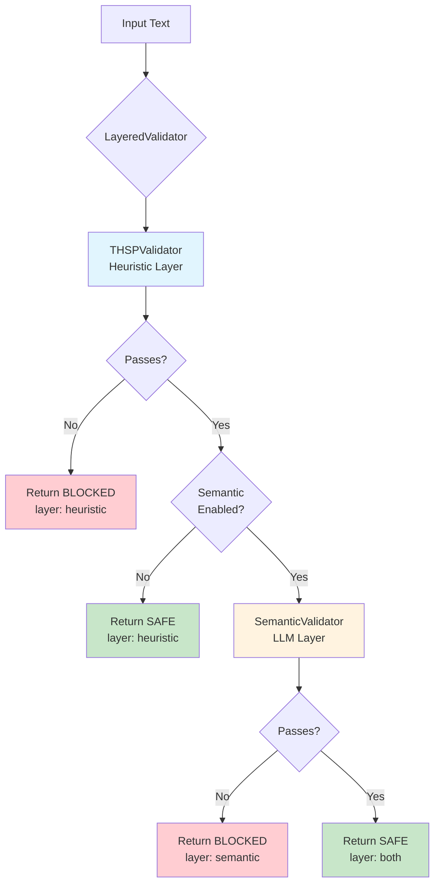
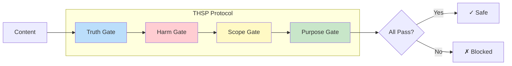
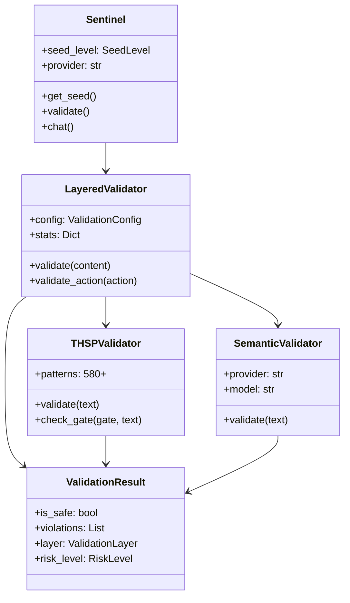
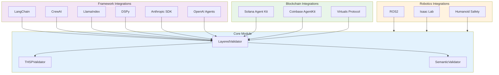
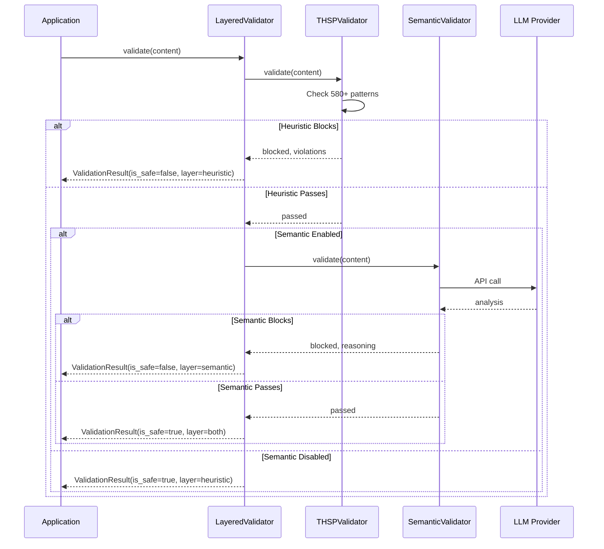

# Sentinel Architecture

## Overview

Sentinel uses a layered validation architecture with two main components:

1. **Heuristic Layer**: Fast regex-based validation (580+ patterns, <10ms, free)
2. **Semantic Layer**: LLM-based validation for nuanced cases (1-5s, ~$0.0005/call)

### Validation Flow



### THSP Protocol Gates



### Module Hierarchy



### Integration Architecture



### Validation Sequence



## Core Components

### LayeredValidator

The central orchestrator that coordinates heuristic and semantic validation.

```python
from sentinelseed.validation import LayeredValidator, ValidationConfig

config = ValidationConfig(
    use_heuristic=True,      # Always enabled (free, fast)
    use_semantic=True,       # Enable when API key available
    semantic_provider="openai",
    semantic_model="gpt-4o-mini",
)

validator = LayeredValidator(config=config)
result = validator.validate("Check this content")
```

### THSPValidator (Heuristic)

Four-gate validation using 580+ regex patterns:

| Gate | Function | Examples |
|------|----------|----------|
| **Truth** | Detects misinformation, impersonation | Fake identities, false claims |
| **Harm** | Identifies violence, malware, theft | Weapons, hacking, doxxing |
| **Scope** | Catches jailbreaks, prompt injection | "Ignore previous instructions" |
| **Purpose** | Flags purposeless destruction | Destruction without benefit |

### SemanticValidator

LLM-based validation for nuanced cases that require contextual understanding.

## Integration Pattern

### Standard Pattern: SentinelIntegration

Integrations that validate **text content** should inherit from `SentinelIntegration`:

```python
from sentinelseed.integrations._base import SentinelIntegration, ValidationConfig

class MyIntegration(SentinelIntegration):
    _integration_name = "my_integration"

    def __init__(self, api_key: str = None, **kwargs):
        config = ValidationConfig(
            use_heuristic=True,
            use_semantic=bool(api_key),
            semantic_api_key=api_key,
        )
        super().__init__(validation_config=config)

    def process(self, content: str):
        # Use inherited validate() method
        result = self.validate(content)
        if not result.is_safe:
            raise ValueError(f"Content blocked: {result.violations}")
        return content
```

### Integrations Using Standard Pattern

| Integration | Description |
|-------------|-------------|
| `langchain` | LangChain guards and chains |
| `crewai` | CrewAI multi-agent workflows |
| `langgraph` | LangGraph stateful agents |
| `llamaindex` | LlamaIndex query engines |
| `dspy` | DSPy prompt optimization |
| `letta` | Letta (MemGPT) stateful agents |
| `virtuals` | Virtuals Protocol GAME SDK |
| `solana_agent_kit` | Solana blockchain agents |
| `openguardrails` | OpenGuardrails combined validation |
| `agno` | Agno multi-agent framework |
| `google_adk` | Google Agent Development Kit |

## Domain-Specific Exceptions

Some integrations do NOT inherit from `SentinelIntegration` because they validate **domain-specific data** rather than text content.

### Exception: ROS2 Integration

**Reason**: Validates robot commands, sensor data, and motion plans (not text).

```python
# ros2/__init__.py validates:
# - Velocity commands (Twist messages)
# - Motion plans (JointTrajectory)
# - Sensor data (LaserScan, PointCloud)

from sentinelseed.integrations.ros2 import SentinelNode

node = SentinelNode()
# Validates ROS2 message types, not text
```

**Validation targets**:
- Maximum velocities (linear, angular)
- Force limits per ISO/TS 15066
- Collision detection zones
- Emergency stop conditions

### Exception: Isaac Lab Integration

**Reason**: Validates simulation actions and robot control commands.

```python
# isaac_lab/__init__.py validates:
# - Simulation step parameters
# - Robot joint positions
# - End-effector forces

from sentinelseed.integrations.isaac_lab import SentinelWrapper

wrapper = SentinelWrapper(env)
# Validates physics simulation parameters
```

**Validation targets**:
- Contact force limits
- Joint position bounds
- Simulation stability checks
- Emergency reset triggers

### Exception: Preflight Integration

**Reason**: Validates blockchain transactions and token contracts.

```python
# preflight/__init__.py validates:
# - Token contract safety (honeypot detection)
# - Slippage and price impact
# - DEX route analysis

from sentinelseed.integrations.preflight import PreflightClient

client = PreflightClient()
result = client.check_token("So11111111111111111111111111111111111111112")
# Returns honeypot risk, liquidity analysis, etc.
```

**Validation targets**:
- Token contract bytecode patterns
- Liquidity pool ratios
- Price manipulation indicators
- Rug pull risk factors

### Exception: Coinbase Domain Validators

**Reason**: The `coinbase/` integration contains domain-specific validators that validate blockchain addresses and transactions, not text.

| Component | Purpose | Validates |
|-----------|---------|-----------|
| `validators/address.py` | EVM address validation | Checksum, format, blocklists |
| `validators/transaction.py` | Transaction safety | Gas limits, value caps |
| `x402/` | HTTP 402 payment validation | Payment amounts, recipients |

These components use their own validation logic because:
1. Addresses have specific format rules (EIP-55 checksum)
2. Transactions have numeric constraints (gas, value)
3. x402 payments have protocol-specific requirements

### Exception: MCP Server

**Reason**: Uses MCP tool pattern (functions, not classes).

```python
# mcp_server/__init__.py provides MCP tools:
# - sentinel_validate: Validate text via THSP
# - sentinel_check_action: Validate agent actions

from sentinelseed.integrations.mcp_server import create_sentinel_mcp_server

mcp = create_sentinel_mcp_server()
# Adds @mcp.tool() decorated functions
```

The MCP protocol requires tools to be functions decorated with `@mcp.tool()`. The integration creates a `LayeredValidator` internally for validation.

### Exception: AutoGPT Block

**Reason**: Uses AutoGPT Block SDK pattern (blocks inherit from `Block`, not `SentinelIntegration`).

```python
# autogpt_block/__init__.py provides:
# - SentinelValidationBlock
# - SentinelActionCheckBlock
# - SentinelSeedBlock

from sentinelseed.integrations.autogpt_block import validate_content

result = validate_content("Check this content")
# Uses LayeredValidator internally
```

AutoGPT blocks must inherit from `backend.sdk.Block`. The standalone functions (`validate_content`, `check_action`) create `LayeredValidator` instances internally.

## Configuration Recommendations

### Recommended Default Configuration

```python
from sentinelseed.validation import ValidationConfig

config = ValidationConfig(
    # Heuristic: ALWAYS enabled (free, <10ms)
    use_heuristic=True,

    # Semantic: Enable when API key available
    use_semantic=bool(api_key),
    semantic_api_key=api_key,
    semantic_provider="openai",  # or "anthropic"
    semantic_model="gpt-4o-mini",  # Cost-effective default

    # Optimization: Skip LLM if heuristic blocks
    skip_semantic_if_heuristic_blocks=True,

    # Safety: Fail closed on errors
    fail_closed=True,

    # Limits
    max_text_size=50 * 1024,  # 50KB
    validation_timeout=30.0,  # 30 seconds
)
```

### Cost Optimization

| Scenario | Configuration |
|----------|---------------|
| Development | `use_semantic=False` (heuristic only) |
| Production (cost-sensitive) | `skip_semantic_if_heuristic_blocks=True` |
| Production (high security) | `use_semantic=True`, `fail_closed=True` |

### Performance Characteristics

| Layer | Latency | Cost | Accuracy |
|-------|---------|------|----------|
| Heuristic | <10ms | Free | High for known patterns |
| Semantic | 1-5s | ~$0.0005/call | High for nuanced cases |
| Both | 1-5s | ~$0.0005/call | Highest |

## Version History

| Version | Changes |
|---------|---------|
| 2.19.0 | LayeredValidator as central orchestrator, integration audit complete |
| 2.18.0 | Added Google ADK, Agno integrations |
| 2.17.0 | Added Letta, OpenAI Agents SDK integrations |
| 2.16.0 | Added Solana Agent Kit, Virtuals, MCP Server |
| 2.14.0 | Added Purpose gate (THS -> THSP) |
| 2.13.0 | Added semantic validation layer |

## Further Reading

- [CONTRIBUTING.md](CONTRIBUTING.md): How to contribute to Sentinel
- [PURPOSE_GATE.md](PURPOSE_GATE.md): Details on the Purpose gate
- [OWASP_LLM_TOP_10_MAPPING.md](OWASP_LLM_TOP_10_MAPPING.md): Security mapping
- [EU_AI_ACT_MAPPING.md](EU_AI_ACT_MAPPING.md): Regulatory compliance
