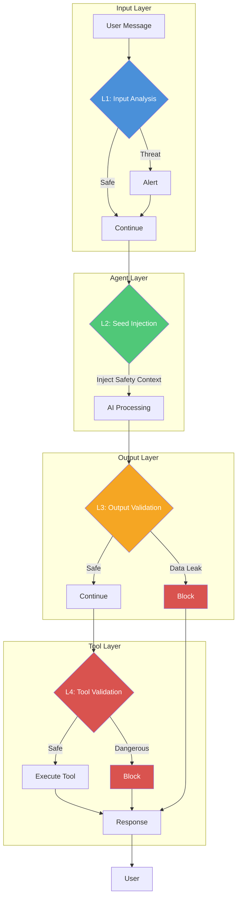

# @sentinelseed/moltbot

AI safety guardrails for [Moltbot](https://github.com/moltbot/moltbot) - your personal AI agent guardian.

> *"Sentinel sees everything, alerts when it matters, and only intervenes if you want."*

## Quick Start

```bash
npm install @sentinelseed/moltbot
```

Add to your Moltbot config:

```json
{
  "plugins": {
    "sentinel": {
      "level": "watch"
    }
  }
}
```

That's it. Sentinel is now monitoring your agent.

## Protection Levels

| Level | Blocking | Alerting | Seed | Best For |
|-------|----------|----------|------|----------|
| `off` | None | None | None | Disable Sentinel |
| `watch` | None | All threats | Standard | Daily use, full visibility |
| `guard` | Critical | High+ threats | Standard | Sensitive data environments |
| `shield` | Maximum | All threats | Strict | High-security workflows |

### Level Details

**watch** (default)
- Logs all activity
- Alerts on threats
- Never blocks
- Zero friction

**guard**
- Blocks data leaks (API keys, passwords, credentials)
- Blocks destructive commands (rm, drop, truncate)
- Blocks system path access
- Allows everything else

**shield**
- All guard protections
- Blocks suspicious URLs
- Stricter seed injection
- Maximum protection

## Escape Hatches

Sentinel respects your autonomy. When you need to bypass protection:

```bash
/sentinel pause 5m          # Pause for 5 minutes
/sentinel allow-once        # Allow next action
/sentinel trust bash        # Trust a tool for the session
/sentinel resume            # Resume protection
```

### Allow-Once

Temporarily bypass the next blocked action:

```bash
/sentinel allow-once        # Any action
/sentinel allow-once output # Only output validation
/sentinel allow-once tool   # Only tool validation
```

Token expires after 30 seconds or first use.

### Pause Protection

Pause all validation for a duration:

```bash
/sentinel pause             # 5 minutes (default)
/sentinel pause 10m         # 10 minutes
/sentinel pause 1h          # 1 hour
```

### Trust Tools

Allow specific tools to bypass validation:

```bash
/sentinel trust bash        # Trust bash
/sentinel trust mcp__*      # Trust all MCP tools (wildcard)
/sentinel untrust bash      # Revoke trust
```

## CLI Commands

```bash
/sentinel status            # Current status
/sentinel level [new]       # View/change level
/sentinel log [count]       # View recent audit entries
/sentinel pause <duration>  # Pause protection
/sentinel resume            # Resume protection
/sentinel allow-once [scope]# One-time bypass
/sentinel trust <tool>      # Trust a tool
/sentinel untrust <tool>    # Revoke trust
/sentinel help              # Show all commands
```

## Configuration

### Basic Configuration

```json
{
  "plugins": {
    "sentinel": {
      "level": "guard"
    }
  }
}
```

### Full Configuration

```json
{
  "plugins": {
    "sentinel": {
      "level": "guard",
      "alerts": {
        "enabled": true,
        "webhook": "https://your-webhook.com/sentinel",
        "minSeverity": "high"
      },
      "ignorePatterns": ["MY_SAFE_TOKEN", "TEST_KEY_*"],
      "logLevel": "warn"
    }
  }
}
```

### Configuration Options

| Option | Type | Default | Description |
|--------|------|---------|-------------|
| `level` | string | `"watch"` | Protection level: off, watch, guard, shield |
| `alerts.enabled` | boolean | `false` | Enable webhook alerts |
| `alerts.webhook` | string | - | Webhook URL for alerts |
| `alerts.minSeverity` | string | `"medium"` | Minimum severity: low, medium, high, critical |
| `ignorePatterns` | string[] | `[]` | Patterns to ignore in validation |
| `logLevel` | string | `"info"` | Log level: debug, info, warn, error |

## Programmatic API

### Hook Factory

```typescript
import { createSentinelHooks } from '@sentinelseed/moltbot';

const hooks = createSentinelHooks({
  level: 'guard',
  alerts: {
    enabled: true,
    webhook: 'https://your-webhook.com/sentinel'
  }
});

// Register with Moltbot
export const moltbot_hooks = {
  message_received: hooks.messageReceived,
  before_agent_start: hooks.beforeAgentStart,
  message_sending: hooks.messageSending,
  before_tool_call: hooks.beforeToolCall,
  agent_end: hooks.agentEnd,
};
```

### Escape Manager

```typescript
import { EscapeManager } from '@sentinelseed/moltbot';

const escapes = new EscapeManager();

// Grant allow-once token
escapes.grantAllowOnce('session-id', { scope: 'output' });

// Pause protection
escapes.pauseProtection('session-id', { durationMs: 300000 });

// Trust a tool
escapes.trustTool('session-id', 'bash', { level: 'session' });

// Check protection status
const shouldAllow = escapes.shouldAllowOutput('session-id');
```

### Audit Log

```typescript
import { AuditLog } from '@sentinelseed/moltbot';

const audit = new AuditLog({ maxEntries: 1000 });

// Query entries
const recent = audit.getRecent(10);
const sessionEntries = audit.query({ sessionId: 'my-session' });
const blockedEntries = audit.query({ outcome: 'blocked' });

// Get statistics
const stats = audit.getStats();
console.log(`Total: ${stats.totalEntries}, Blocked: ${stats.byOutcome.blocked}`);
```

### Alert Manager

```typescript
import { AlertManager } from '@sentinelseed/moltbot';

const alerts = new AlertManager({
  webhooks: [{
    url: 'https://your-webhook.com/sentinel',
    minSeverity: 'high'
  }],
  rateLimitWindowMs: 60000,
  rateLimitMax: 10
});

// Send alerts
await alerts.alertHighThreatInput(5, issues, 'session-id');
await alerts.alertActionBlocked('output', 'Data leak detected', 'session-id');
```

### Validators

```typescript
import { validateOutput, validateTool, analyzeInput } from '@sentinelseed/moltbot';
import { getLevelConfig } from '@sentinelseed/moltbot';

const levelConfig = getLevelConfig('guard');

// Validate output
const outputResult = await validateOutput(content, levelConfig);
if (outputResult.shouldBlock) {
  console.log('Blocked:', outputResult.issues);
}

// Validate tool call
const toolResult = await validateTool('bash', { command: 'rm -rf /' }, levelConfig);
if (toolResult.shouldBlock) {
  console.log('Blocked:', toolResult.issues);
}

// Analyze input
const inputResult = await analyzeInput(userMessage);
if (inputResult.threatLevel >= 4) {
  console.log('High threat input:', inputResult.issues);
}
```

## How It Works

Sentinel integrates with Moltbot hooks to provide layered protection:



### Validation Layers

| Layer | Hook | Function | Can Block |
|-------|------|----------|-----------|
| **L1** | `message_received` | Analyze input for threats | No (alerts only) |
| **L2** | `before_agent_start` | Inject safety seed | No (context only) |
| **L3** | `message_sending` | Validate output content | Yes |
| **L4** | `before_tool_call` | Validate tool calls | Yes |

### What Gets Detected

**Input Analysis (L1)**
- Prompt injection attempts
- Jailbreak patterns (DAN, ignore instructions, etc.)
- Role manipulation
- System prompt extraction attempts

**Output Validation (L3)**
- API keys (OpenAI, Anthropic, AWS, etc.)
- Passwords and credentials
- Private keys and tokens
- Credit card numbers
- Social security numbers

**Tool Validation (L4)**
- Destructive commands (rm, drop, truncate)
- System path access (/etc, C:\Windows)
- Network operations to dangerous domains
- Privilege escalation attempts

## Webhook Payload

When alerts are enabled, Sentinel sends POST requests to your webhook:

```json
{
  "type": "high_threat_input",
  "severity": "critical",
  "message": "High threat input detected (level 5): jailbreak",
  "timestamp": "2024-01-15T10:30:00.000Z",
  "sessionId": "session-123",
  "context": {
    "threatLevel": 5,
    "issueCount": 2
  }
}
```

## Philosophy

**Copilot, not gatekeeper.** Sentinel is designed for power users who want visibility and protection without losing control. The default `watch` mode provides full monitoring with zero blocking, while higher levels add protection you can always bypass when needed.

**Defense in depth.** Multiple validation layers catch different threat types. Even if one layer is bypassed, others provide protection.

**Fail open for usability.** In watch mode, nothing is blocked. In higher modes, only clear threats are blocked. When in doubt, Sentinel alerts rather than blocks.

## Compatibility

- Node.js 18+
- Moltbot 0.1.x

## Links

- [Sentinel Core](https://github.com/sentinel-seed/sentinel)
- [Moltbot](https://github.com/moltbot/moltbot)
- [Documentation](https://sentinelseed.dev)

## License

MIT - Sentinel Team
