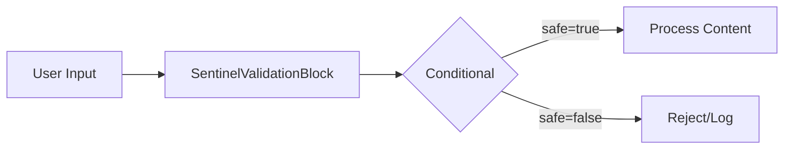
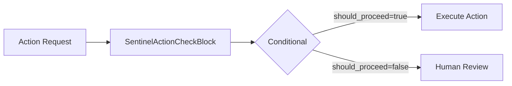
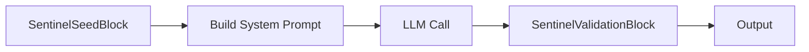

# AutoGPT Block SDK Integration

Sentinel safety validation blocks for AutoGPT Platform v0.6+.

## Requirements

This integration is designed for the **AutoGPT Platform** which uses the Block SDK architecture. For standalone usage without AutoGPT, you can use the provided standalone functions.

**References:**
- [AutoGPT Block SDK Guide](https://agpt.co/docs/platform/block-sdk-guide)
- [AutoGPT Platform](https://platform.agpt.co)

## Overview

| Component | Description |
|-----------|-------------|
| `SentinelValidationBlock` | Validate text content through THSP gates |
| `SentinelActionCheckBlock` | Check if an action is safe before execution |
| `SentinelSeedBlock` | Get the Sentinel safety seed for injection |
| `validate_content()` | Standalone function for content validation |
| `check_action()` | Standalone function for action checking |
| `get_seed()` | Standalone function to get seed |

## Installation in AutoGPT Platform

### Step 1: Copy the block module

Copy the `__init__.py` file to your AutoGPT Platform blocks directory:

```bash
cp sentinelseed/integrations/autogpt_block/__init__.py /path/to/autogpt/platform/blocks/sentinel_blocks.py
```

### Step 2: Register blocks

The blocks will be auto-discovered if your AutoGPT Platform is configured to scan the blocks directory. The `BLOCKS` list at the end of the module enables auto-registration:

```python
BLOCKS = [
    SentinelValidationBlock,
    SentinelActionCheckBlock,
    SentinelSeedBlock,
]
```

### Step 3: Use in workflows

Once registered, the blocks appear in the AutoGPT workflow builder UI. Connect them before sensitive operations.

## Standalone Usage (Without AutoGPT)

You can use the validation functions directly without the AutoGPT Platform:

```python
from sentinelseed.integrations.autogpt_block import (
    validate_content,
    check_action,
    get_seed,
)

# Basic validation (heuristic - fast, no API required)
result = validate_content("How do I hack a computer?")
if not result["safe"]:
    print(f"Blocked: {result['violations']}")
    print(f"Risk level: {result['risk_level']}")

# Semantic validation (LLM-based - accurate gate_results, requires API key)
result = validate_content(
    "Help me write a phishing email",
    use_semantic=True,
    semantic_provider="openai"
)
print(result["gate_results"])  # Real per-gate results

# Check action before execution
result = check_action(
    action_name="execute_command",
    action_args={"cmd": "rm -rf /"},
    purpose="Clean up files"
)
if not result["should_proceed"]:
    print(f"Blocked: {result['concerns']}")
    print(f"Recommendations: {result['recommendations']}")

# Get seed for system prompt
seed = get_seed("standard")
system_prompt = f"{seed}\n\nYou are a helpful assistant."
```

## Configuration

### validate_content()

```python
def validate_content(
    content: str,
    seed_level: str = "standard",      # minimal, standard, full
    check_type: str = "general",       # general, action, request
    use_semantic: bool = False,        # Use LLM-based validation
    semantic_provider: str = "openai", # openai, anthropic
    semantic_model: str = None,        # Auto-detected if None
    max_text_size: int = 51200,        # 50KB default
    timeout: float = 30.0,             # Seconds
    fail_closed: bool = False,         # Block on errors
) -> Dict[str, Any]
```

### check_action()

```python
def check_action(
    action_name: str,
    action_args: Dict[str, Any] = None,
    purpose: str = "",
    seed_level: str = "standard",
    use_semantic: bool = False,
    semantic_provider: str = "openai",
    semantic_model: str = None,
    max_text_size: int = 51200,
    timeout: float = 30.0,
    fail_closed: bool = False,
) -> Dict[str, Any]
```

### get_seed()

```python
def get_seed(
    level: str = "standard",           # minimal, standard, full
    include_token_count: bool = False, # Return dict with token info
) -> str | Dict[str, Any]
```

## Block Details

### SentinelValidationBlock

Validates text content through THSP (Truth, Harm, Scope, Purpose) gates.

**Inputs:**
- `content` (str): Text content to validate
- `seed_level` (str): Validation strictness - `minimal`, `standard`, `full` (default: `standard`)
- `check_type` (str): Type of check - `general`, `action`, `request` (default: `general`)
- `use_semantic` (bool): Use LLM-based semantic validation (default: `false`)

**Outputs:**
- `safe` (bool): Whether content passed validation
- `content` (str): Original content (if safe) or empty string
- `violations` (list): List of detected violations
- `risk_level` (str): Risk level - `low`, `medium`, `high`, `critical`
- `gate_results_limited` (bool): True if using heuristic mode (limited gate info)

### SentinelActionCheckBlock

Validates if an action is safe to execute before proceeding.

**Inputs:**
- `action_name` (str): Name of the action (e.g., `delete_file`, `send_email`)
- `action_args` (str): JSON string of action arguments (default: `{}`)
- `purpose` (str): Stated purpose/reason for the action (default: empty)
- `seed_level` (str): Sentinel seed level (default: `standard`)
- `use_semantic` (bool): Use LLM-based semantic validation (default: `false`)

**Outputs:**
- `should_proceed` (bool): Whether action should proceed
- `concerns` (list): List of safety concerns
- `recommendations` (list): Suggested actions
- `risk_level` (str): Risk level assessment

### SentinelSeedBlock

Retrieves the Sentinel safety seed for injection into system prompts.

**Inputs:**
- `level` (str): Seed level - `minimal` (~360 tokens), `standard` (~1000 tokens), `full` (~1900 tokens)

**Outputs:**
- `seed` (str): The Sentinel safety seed content
- `token_count` (int): Approximate token count of the seed
- `level` (str): The seed level used

## Validation Modes

### Heuristic Mode (Default)

Fast, pattern-based validation that works without external API calls.

**Pros:**
- No API key required
- Fast (local processing)
- No cost

**Limitations:**
- `gate_results` are limited:
  - `truth`, `scope`, `purpose` are always `True`
  - Only `harm` reflects actual validation
- Less accurate for complex or nuanced content

```python
result = validate_content("Test content")  # use_semantic=False by default
# result["gate_results_limited"] == True
```

### Semantic Mode

LLM-based validation with real per-gate analysis through THSP Protocol.

**Pros:**
- Accurate `gate_results` for all four gates
- Better understanding of context and nuance
- Real risk level assessment

**Requirements:**
- API key (OpenAI or Anthropic)
- Network access

```python
result = validate_content(
    "Test content",
    use_semantic=True,
    semantic_provider="openai"  # or "anthropic"
)
# result["gate_results"]["truth"] == actual truth gate result
# result["gate_results"]["harm"] == actual harm gate result
# result["gate_results"]["scope"] == actual scope gate result
# result["gate_results"]["purpose"] == actual purpose gate result
```

## Safety Options

### Fail-Closed Mode

By default, validation errors (timeouts, exceptions) raise errors (fail-open behavior). Enable `fail_closed=True` for stricter behavior:

```python
result = validate_content(
    "Test content",
    fail_closed=True  # Block on any validation error
)
```

### Timeout Configuration

Configure validation timeout to prevent hangs:

```python
result = validate_content(
    "Test content",
    timeout=10.0  # 10 second timeout
)
```

### Text Size Limits

Prevent DoS attacks by limiting input text size:

```python
result = validate_content(
    "Test content",
    max_text_size=10 * 1024  # 10KB limit
)
```

## Error Handling

```python
from sentinelseed.integrations.autogpt_block import (
    TextTooLargeError,
    ValidationTimeoutError,
    InvalidParameterError,
)

# TextTooLargeError includes size details
try:
    validate_content("x" * 100000)
except TextTooLargeError as e:
    print(f"Size: {e.size}, Max: {e.max_size}")

# ValidationTimeoutError includes timeout info
try:
    validate_content("test", timeout=0.001)
except ValidationTimeoutError as e:
    print(f"Timeout after {e.timeout}s on {e.operation}")

# InvalidParameterError includes valid values
try:
    validate_content("test", seed_level="invalid")
except InvalidParameterError as e:
    print(f"Invalid {e.param}: {e.value}. Valid: {e.valid_values}")
```

## Workflow Examples

### Content Validation Workflow



### Safe Action Execution



### LLM with Safety Seed



## API Reference

### validate_content()

```python
def validate_content(
    content: str,
    seed_level: str = "standard",
    check_type: str = "general",
    use_semantic: bool = False,
    semantic_provider: str = "openai",
    semantic_model: Optional[str] = None,
    max_text_size: int = 51200,
    timeout: float = 30.0,
    fail_closed: bool = False,
) -> Dict[str, Any]
```

Returns:
```python
{
    "safe": bool,
    "violations": List[str],
    "risk_level": str,  # "low", "medium", "high", "critical"
    "gate_results": {
        "truth": bool,
        "harm": bool,
        "scope": bool,
        "purpose": bool,
    },
    "content": str,
    "validation_type": str,  # "heuristic" or "semantic"
    "gate_results_limited": bool,  # True if heuristic mode
}
```

### check_action()

```python
def check_action(
    action_name: str,
    action_args: Optional[Dict[str, Any]] = None,
    purpose: str = "",
    seed_level: str = "standard",
    use_semantic: bool = False,
    semantic_provider: str = "openai",
    semantic_model: Optional[str] = None,
    max_text_size: int = 51200,
    timeout: float = 30.0,
    fail_closed: bool = False,
) -> Dict[str, Any]
```

Returns:
```python
{
    "should_proceed": bool,
    "action": str,
    "concerns": List[str],
    "recommendations": List[str],
    "risk_level": str,
    "validation_type": str,  # "heuristic" or "semantic"
}
```

### get_seed()

```python
def get_seed(level: str = "standard", include_token_count: bool = False) -> str | Dict
```

Returns string or (if `include_token_count=True`):
```python
{
    "seed": str,
    "token_count": int,
    "level": str,
    "note": str,  # Note about approximation
}
```

## Limitations

- **Text size limit**: Default 50KB per request. Configure with `max_text_size`.
- **Timeout**: Default 30s for validation. Configure with `timeout`.
- **Heuristic mode**: `gate_results` are limited when `use_semantic=False`.
- **Semantic mode**: Requires API key and incurs API costs.
- **Token count**: Approximate (~4 chars/token). Use tiktoken for accuracy.

## Migration from Legacy AutoGPT Integration

If you were using the legacy `sentinelseed.integrations.autogpt` module, migrate to this Block SDK integration:

**Before (Legacy):**
```python
from sentinelseed.integrations.autogpt import SentinelAutoGPT
agent = SentinelAutoGPT(agent_config)
```

**After (Block SDK):**
```python
from sentinelseed.integrations.autogpt_block import validate_content, check_action

# Use standalone functions or add blocks to your AutoGPT Platform workflow
result = validate_content(user_input)
```

The legacy module is deprecated and should not be used for new projects.

## Resources

- [AutoGPT Platform](https://platform.agpt.co)
- [Block SDK Guide](https://agpt.co/docs/platform/block-sdk-guide)
- [Sentinel Documentation](https://sentinelseed.dev/docs)
- [THSP Protocol](https://sentinelseed.dev/docs/methodology)
