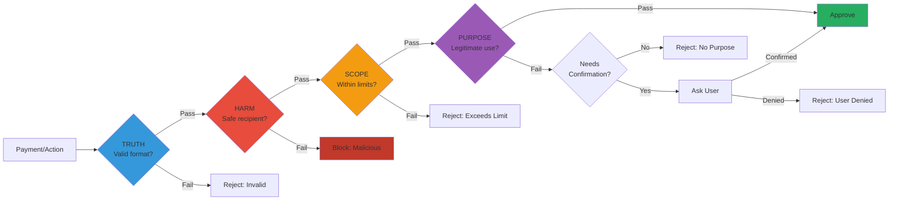

# Sentinel Coinbase Integration

Comprehensive security integration for the Coinbase ecosystem, providing guardrails for AI agents using AgentKit and x402 payment validation.

## Overview

This integration provides:

- **AgentKit Guardrails**: ActionProvider with THSP validation for all AgentKit actions
- **x402 Payment Validation**: THSP-based validation for HTTP 402 payments
- **EVM Address Validation**: EIP-55 checksum validation
- **Transaction Limits**: Configurable spending limits and rate limiting
- **DeFi Risk Assessment**: Risk analysis for DeFi protocol interactions

## Installation

```bash
pip install sentinelseed

# For full AgentKit support:
pip install sentinelseed coinbase-agentkit

# For x402 support:
pip install sentinelseed x402 httpx
```

## Quick Start

### AgentKit Integration

```python
from coinbase_agentkit import AgentKit
from sentinelseed.integrations.coinbase import sentinel_action_provider

# Create security provider with strict profile
provider = sentinel_action_provider(security_profile="strict")

# Add to your AgentKit agent
agent = AgentKit(action_providers=[provider])

# The provider adds these security actions:
# - sentinel_validate_transaction
# - sentinel_validate_address
# - sentinel_check_action_safety
# - sentinel_get_spending_summary
# - sentinel_assess_defi_risk
# - sentinel_configure_guardrails
# - sentinel_block_address
# - sentinel_unblock_address
```

### Transaction Validation

```python
from sentinelseed.integrations.coinbase import (
    TransactionValidator,
    ChainType,
    get_default_config,
)

# Create validator
config = get_default_config("standard")
validator = TransactionValidator(config=config)

# Validate before any transaction
result = validator.validate(
    action="native_transfer",
    from_address="0x123...",
    to_address="0x456...",
    amount=50.0,  # USD equivalent
    chain=ChainType.BASE_MAINNET,
    purpose="Payment for API services",
)

if result.should_proceed:
    # Execute transaction
    pass
elif result.requires_confirmation:
    # Ask user for confirmation
    pass
else:
    print(f"Blocked: {result.blocked_reason}")
```

### x402 Payment Validation

```python
from sentinelseed.integrations.coinbase import (
    SentinelX402Middleware,
    get_x402_config,
)

# Create middleware
middleware = SentinelX402Middleware()

# Validate payment
result = middleware.validate_payment(
    endpoint="https://api.example.com/paid",
    payment_requirements=payment_req,
    wallet_address="0x123...",
)

if result.is_approved:
    print("Payment safe to proceed")
else:
    print(f"Payment blocked: {result.issues}")
```

## Security Profiles

| Profile | Max Single | Max Daily | Confirmation | Use Case |
|---------|------------|-----------|--------------|----------|
| `permissive` | $1,000 | $5,000 | $100 | Development, testing |
| `standard` | $100 | $500 | $25 | General usage (default) |
| `strict` | $25 | $100 | $10 | Production with caution |
| `paranoid` | $10 | $50 | $5 | Maximum security |

```python
from sentinelseed.integrations.coinbase import get_default_config

# Get config for a profile
config = get_default_config("strict")
```

## AgentKit Actions Reference

### sentinel_validate_transaction

Validate a transaction before execution. **Always call this before any financial operation.**

```python
result = provider.validate_transaction({
    "action": "native_transfer",
    "from_address": "0x123...",
    "to_address": "0x456...",
    "amount": 50.0,
    "chain": "base-mainnet",
    "purpose": "Payment for services",
})
```

### sentinel_validate_address

Validate an Ethereum address format and checksum.

```python
result = provider.validate_address_action({
    "address": "0x742d35Cc6634C0532925a3b844Bc454e4438f44e",
    "require_checksum": True,
})
```

### sentinel_check_action_safety

Check if any action is safe to execute.

```python
result = provider.check_action_safety({
    "action_name": "native_transfer",
    "action_args": {"amount": 50},
    "purpose": "Regular payment",
})
```

### sentinel_assess_defi_risk

Assess DeFi operation risk before supply, borrow, trade, etc.

```python
result = provider.assess_defi_risk_action({
    "protocol": "compound",
    "action": "borrow",
    "amount": 500.0,
    "collateral_ratio": 1.8,
})
```

### sentinel_get_spending_summary

Get current spending stats and remaining limits.

```python
result = provider.get_spending_summary({
    "wallet_address": "0x123...",
})
```

### sentinel_configure_guardrails

Adjust security settings at runtime.

```python
result = provider.configure_guardrails({
    "security_profile": "strict",
    "block_unlimited_approvals": True,
})
```

## Action Wrappers

Wrap existing functions with automatic validation:

```python
from sentinelseed.integrations.coinbase import safe_action

@safe_action(action_type="native_transfer")
def transfer_eth(to: str, amount: float, from_address: str = None):
    # Your transfer logic here
    pass

# This will validate before executing
transfer_eth("0x456...", 50.0, from_address="0x123...")
```

## EVM Address Validation

```python
from sentinelseed.integrations.coinbase import (
    validate_address,
    is_valid_evm_address,
    to_checksum_address,
)

# Quick format check
is_valid = is_valid_evm_address("0x742d35Cc...")

# Full validation with details
result = validate_address("0x742d35Cc...", require_checksum=True)
print(result.valid)           # True/False
print(result.is_checksummed)  # True/False
print(result.checksum_address)  # Correct checksum version

# Convert to checksum
checksummed = to_checksum_address("0x742d35cc...")
```

## DeFi Risk Assessment

```python
from sentinelseed.integrations.coinbase import assess_defi_risk

# Assess a borrow operation
assessment = assess_defi_risk(
    protocol="compound",
    action="borrow",
    amount=1000.0,
    collateral_ratio=1.5,
)

print(assessment.risk_level)      # low, medium, high, critical
print(assessment.risk_score)       # 0-100
print(assessment.risk_factors)     # List of identified risks
print(assessment.recommendations)  # Risk mitigation suggestions
```

## Blocked Actions Detection

The integration automatically detects and blocks:

- **Unlimited token approvals** (MAX_UINT256)
- **Drain wallet patterns**
- **Private key exposure**
- **Transactions to blocked addresses**
- **Rate limit violations**

## Architecture

```
┌─────────────────────────────────────────────────────────────────────────────┐
│                    SENTINEL COINBASE PROTECTION FRAMEWORK                    │
├─────────────────────────────────────────────────────────────────────────────┤
│                                                                             │
│   INPUT LAYER                                                               │
│   ├── Prompt injection detection (THSPValidator)                           │
│   ├── Jailbreak pre-filter                                                 │
│   └── Request validation                                                   │
│                                                                             │
│   TOOL LAYER                                                                │
│   ├── Action whitelist/blacklist                                           │
│   ├── Rate limiting (max_transactions_per_hour)                            │
│   └── Permission boundaries (blocked_actions)                              │
│                                                                             │
│   TRANSACTION LAYER (EVM-specific)                                         │
│   ├── Address validation (checksum, format)                                │
│   ├── Spending limits (max_transfer, max_daily)                            │
│   ├── Blocked addresses (known malicious)                                  │
│   ├── Approval detection (unlimited approve = blocked)                     │
│   └── Chain-aware limits (testnet vs mainnet)                              │
│                                                                             │
│   PAYMENT LAYER (x402)                                                     │
│   ├── Payment validation (THSP gates)                                      │
│   ├── Spending tracking                                                    │
│   └── Security profiles (permissive/standard/strict/paranoid)              │
│                                                                             │
└─────────────────────────────────────────────────────────────────────────────┘
```

### x402 Payment Flow

The following diagram shows how Sentinel intercepts and validates x402 payments before they reach the blockchain:

```mermaid
sequenceDiagram
    participant Client as AI Agent
    participant Sentinel as Sentinel Middleware
    participant Server as x402 Resource Server
    participant Facilitator as x402 Facilitator
    participant Chain as Blockchain

    Client->>Server: 1. HTTP Request
    Server-->>Client: 2. 402 Payment Required

    Note over Client,Sentinel: Sentinel Intercepts Here

    Client->>Sentinel: 3. Payment Request

    rect rgb(50, 50, 80)
        Note over Sentinel: THSP Validation Gates
        Sentinel->>Sentinel: TRUTH: Valid format?
        Sentinel->>Sentinel: HARM: Blocked address?
        Sentinel->>Sentinel: SCOPE: Within limits?
        Sentinel->>Sentinel: PURPOSE: Legitimate?
    end

    alt All Gates Pass
        Sentinel->>Server: 4. Forward with Payment Signature
        Server->>Facilitator: 5. Verify Payment
        Facilitator-->>Server: 6. Verification OK
        Server->>Facilitator: 7. Settle Payment
        Facilitator->>Chain: 8. Submit Transaction
        Chain-->>Facilitator: 9. Confirmation
        Facilitator-->>Server: 10. Settlement Complete
        Server-->>Client: 11. 200 OK + Resource
    else Any Gate Fails
        Sentinel-->>Client: BLOCKED: Reason
        Note over Client: Payment prevented
    end
```



### AgentKit Action Flow

The following diagram shows how Sentinel validates AgentKit actions before execution:

```mermaid
flowchart TB
    subgraph Agent["AI Agent (LangChain/OpenAI/etc)"]
        LLM[LLM Decision]
    end

    subgraph AgentKit["Coinbase AgentKit"]
        Actions[Action Providers]
        Wallet[Wallet Provider]
    end

    subgraph Sentinel["Sentinel ActionProvider"]
        direction TB
        Validate[validate_transaction]
        Check[check_action_safety]
        DeFi[assess_defi_risk]

        subgraph THSP["THSP Gates"]
            T[Truth]
            H[Harm]
            S[Scope]
            P[Purpose]
        end
    end

    subgraph Blockchain["Blockchain"]
        TX[Transaction]
    end

    LLM -->|"native_transfer"| Actions
    Actions -->|Before Execute| Sentinel
    Validate --> THSP
    Check --> THSP
    DeFi --> THSP

    T --> Decision{All Pass?}
    H --> Decision
    S --> Decision
    P --> Decision

    Decision -->|Yes| Wallet
    Decision -->|No| Block[Block Action]
    Wallet --> TX
    Block -->|Reason| LLM

    style Sentinel fill:#1a1a2e,stroke:#e94560,stroke-width:2px
    style THSP fill:#16213e,stroke:#0f3460
    style Block fill:#c70039,stroke:#900c3f
```



### THSP Gate Decision Flow



## Supported Networks

| Network | Chain ID | Native Token |
|---------|----------|--------------|
| Ethereum Mainnet | ethereum-mainnet | ETH |
| Ethereum Sepolia | ethereum-sepolia | ETH |
| Base Mainnet | base-mainnet | ETH |
| Base Sepolia | base-sepolia | ETH |
| Polygon Mainnet | polygon-mainnet | MATIC |
| Polygon Amoy | polygon-amoy | MATIC |
| Arbitrum Mainnet | arbitrum-mainnet | ETH |
| Arbitrum Sepolia | arbitrum-sepolia | ETH |
| Optimism Mainnet | optimism-mainnet | ETH |
| Optimism Sepolia | optimism-sepolia | ETH |
| Avalanche Mainnet | avalanche-mainnet | AVAX |
| Avalanche Fuji | avalanche-fuji | AVAX |

## High-Risk Actions

These actions require extra validation:

- `native_transfer`
- `transfer` (ERC20)
- `approve`
- `deploy_contract`
- `deploy_token`
- `trade`
- `supply`, `withdraw`, `borrow` (DeFi)
- `create_flow` (Superfluid)
- `buy_token`, `sell_token`, `create_token` (WOW)
- `ssh_connect`, `remote_shell` (SSH)

## Read-Only Actions

These actions are always safe:

- `get_wallet_details`
- `get_balance`
- `fetch_price`
- `get_portfolio`
- `get_flow`
- `account_details`

## Running Examples

```bash
python -m sentinelseed.integrations.coinbase.example
```

## References

- [Coinbase AgentKit](https://github.com/coinbase/agentkit)
- [x402 Protocol](https://github.com/coinbase/x402)
- [Sentinel Documentation](https://sentinelseed.dev)
- [EIP-55 Checksum](https://eips.ethereum.org/EIPS/eip-55)

## License

MIT
