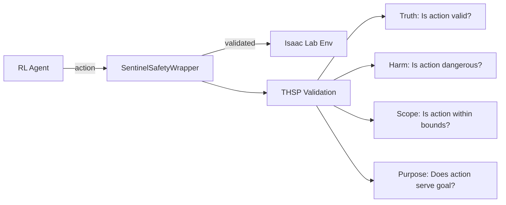

# Sentinel Isaac Lab Integration

Safety middleware for NVIDIA Isaac Lab robot learning environments using THSP (Truth-Harm-Scope-Purpose) validation protocol.

## Overview

This integration provides gymnasium-compatible wrappers that validate robot actions through safety gates before they are executed. It helps prevent unsafe behaviors during reinforcement learning training and deployment.

## Architecture



## Installation

```bash
# Install sentinelseed
pip install sentinelseed

# Isaac Lab (separate installation required)
# See: https://isaac-sim.github.io/IsaacLab/
```

## Quick Start

### Basic Usage

```python
from sentinelseed.integrations.isaac_lab import (
    SentinelSafetyWrapper,
    RobotConstraints,
)

# Create your Isaac Lab environment
env = gym.make("Isaac-Reach-Franka-v0", cfg=cfg)

# Wrap with safety validation
env = SentinelSafetyWrapper(
    env,
    constraints=RobotConstraints.franka_default(),
    mode="clamp",  # clamp, block, warn, or monitor
)

# Use normally - actions are validated automatically
obs, reward, done, truncated, info = env.step(action)

# Check safety statistics
print(env.get_stats())
```

### Safety Modes

| Mode | Behavior |
|------|----------|
| `clamp` | Project unsafe actions to safe region |
| `block` | Reject unsafe actions (use zero/previous) |
| `warn` | Log violations but execute unchanged |
| `monitor` | Collect statistics without intervention |

### Custom Constraints

```python
from sentinelseed.integrations.isaac_lab import (
    JointLimits,
    WorkspaceLimits,
    RobotConstraints,
    CollisionZone,
)

# Define custom joint limits
joint_limits = JointLimits(
    num_joints=6,
    position_lower=[-3.14, -2.0, -3.14, -3.14, -3.14, -3.14],
    position_upper=[3.14, 2.0, 3.14, 3.14, 3.14, 3.14],
    velocity_max=[2.0, 2.0, 2.0, 2.5, 2.5, 2.5],
)

# Define workspace boundaries
workspace = WorkspaceLimits(
    x_min=-0.5, x_max=0.5,
    y_min=-0.5, y_max=0.5,
    z_min=0.0, z_max=1.0,
)

# Create constraints
constraints = RobotConstraints(
    joint_limits=joint_limits,
    workspace_limits=workspace,
)

# Add collision zone
constraints.add_collision_zone(
    CollisionZone.sphere("human", center=(0.3, 0.0, 0.5), radius=0.2)
)
```

### Pre-built Robot Constraints

```python
# Franka Emika Panda (7 DOF)
constraints = RobotConstraints.franka_default()

# Universal Robots UR10 (6 DOF)
constraints = RobotConstraints.ur10_default()

# Or just joint limits
limits = JointLimits.franka_panda()
limits = JointLimits.ur10()
limits = JointLimits.allegro_hand()
```

## Training Integration

### Stable-Baselines3

```python
from stable_baselines3 import PPO
from sentinelseed.integrations.isaac_lab import (
    SentinelSafetyWrapper,
    SentinelSB3Callback,
)

# Wrap environment
env = SentinelSafetyWrapper(base_env, mode="clamp")

# Create model
model = PPO("MlpPolicy", env)

# Create safety callback
callback = SentinelSB3Callback(env, log_interval=1000)

# Train with monitoring
model.learn(
    total_timesteps=100000,
    callback=callback.get_sb3_callback()
)
```

### Weights & Biases Logging

```python
from sentinelseed.integrations.isaac_lab import create_wandb_callback

callback = create_wandb_callback(
    env,
    project="my-robot-training",
    log_interval=100,
)
```

### TensorBoard Logging

```python
from sentinelseed.integrations.isaac_lab import create_tensorboard_callback

callback = create_tensorboard_callback(
    env,
    log_dir="./tensorboard_logs",
    log_interval=100,
)
```

## THSP Gates for Robotics

### Truth Gate
Validates that actions are physically valid:
- No NaN or Inf values
- Values within expected range (e.g., [-1, 1] for normalized)
- Action dimensions match robot configuration

### Harm Gate
Checks for potentially dangerous actions:
- Joint velocities within safety limits
- Forces/torques within safe ranges
- Combined velocity magnitude checks

### Scope Gate
Ensures actions stay within operational boundaries:
- Joint positions within mechanical limits
- End-effector within workspace
- No collision zone violations

### Purpose Gate (Optional)
Validates that actions serve a legitimate purpose:
- Requires explicit purpose context
- Useful for supervised/constrained learning

## API Reference

### Constraints

```python
# Joint limits
limits = JointLimits(
    num_joints: int,
    position_lower: List[float],
    position_upper: List[float],
    velocity_max: List[float],
    acceleration_max: Optional[List[float]] = None,
    effort_max: Optional[List[float]] = None,
)

# Workspace limits
workspace = WorkspaceLimits(
    x_min: float, x_max: float,
    y_min: float, y_max: float,
    z_min: float, z_max: float,
    center: Optional[Tuple[float, float, float]] = None,
    radius: Optional[float] = None,
)

# Combined constraints
constraints = RobotConstraints(
    joint_limits: Optional[JointLimits] = None,
    workspace_limits: Optional[WorkspaceLimits] = None,
    force_torque_limits: Optional[ForceTorqueLimits] = None,
    collision_zones: List[CollisionZone] = [],
    action_scale: float = 1.0,
    require_purpose: bool = False,
)
```

### Wrappers

```python
# Main safety wrapper
env = SentinelSafetyWrapper(
    env: gymnasium.Env,
    constraints: RobotConstraints = None,
    mode: str = "clamp",  # clamp, block, warn, monitor
    action_type: ActionType = ActionType.NORMALIZED,
    on_violation: Callable = None,
    log_violations: bool = True,
    add_safety_info: bool = True,
)

# Simple clamping wrapper
env = ActionClampingWrapper(
    env: gymnasium.Env,
    joint_limits: JointLimits = None,
    clamp_to_normalized: bool = True,
)

# Monitor-only wrapper
env = SafetyMonitorWrapper(
    env: gymnasium.Env,
    constraints: RobotConstraints = None,
    on_violation: Callable = None,
    log_interval: int = 0,
)
```

### Validators

```python
validator = THSPRobotValidator(
    constraints: RobotConstraints = None,
    action_type: ActionType = ActionType.NORMALIZED,
    strict_mode: bool = False,
    log_violations: bool = True,
)

# Validate single action
result = validator.validate(action, context=None)

# Validate batch
result = validator.validate_batch(actions, contexts=None)
```

## Examples

Run the examples to see the integration in action:

```bash
python -m sentinelseed.integrations.isaac_lab.example
```

## Full Isaac Lab Example

```python
from isaaclab.app import AppLauncher

# Initialize Isaac Sim
app_launcher = AppLauncher(headless=True)
simulation_app = app_launcher.app

import gymnasium as gym
import isaaclab_tasks
from isaaclab_tasks.utils import load_cfg_from_registry

from sentinelseed.integrations.isaac_lab import (
    SentinelSafetyWrapper,
    RobotConstraints,
    SentinelSB3Callback,
)

# Create environment
cfg = load_cfg_from_registry("Isaac-Reach-Franka-v0", "env_cfg_entry_point")
cfg.scene.num_envs = 32
env = gym.make("Isaac-Reach-Franka-v0", cfg=cfg)

# Add safety wrapper
env = SentinelSafetyWrapper(
    env,
    constraints=RobotConstraints.franka_default(),
    mode="clamp",
)

# Train with Stable-Baselines3
from stable_baselines3 import PPO
from isaaclab_rl.sb3 import Sb3VecEnvWrapper

# Apply SB3 wrapper AFTER safety wrapper
env = Sb3VecEnvWrapper(env)

model = PPO("MlpPolicy", env, verbose=1)
callback = SentinelSB3Callback(env, log_interval=1000)
model.learn(total_timesteps=100000, callback=callback.get_sb3_callback())

# Cleanup
simulation_app.close()
```

## References

- [Isaac Lab Documentation](https://isaac-sim.github.io/IsaacLab/)
- [Isaac Lab Wrapping Guide](https://isaac-sim.github.io/IsaacLab/main/source/how-to/wrap_rl_env.html)
- [Gymnasium Wrappers](https://gymnasium.farama.org/tutorials/gymnasium_basics/implementing_custom_wrappers/)
- [Safe RL Survey](https://arxiv.org/abs/2108.06266)
- [OmniSafe Framework](https://github.com/PKU-Alignment/omnisafe)

## License

MIT License - See main Sentinel repository for details.
