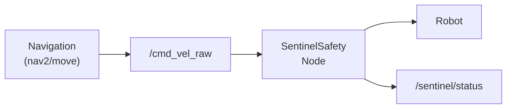

# Sentinel ROS2 Integration

Safety middleware for ROS2 robots using THSP (Truth-Harm-Scope-Purpose) validation.

**Version:** 1.1.0

## Overview

This integration provides THSP-based safety validation for ROS2 robots. It implements a subscribe-validate-publish pattern that filters unsafe commands before they reach robot actuators.



## Installation

```bash
# Install sentinelseed
pip install sentinelseed

# Ensure ROS2 is installed (Humble or later recommended)
# ROS2 packages are installed via apt/rosdep
sudo apt install ros-humble-rclpy ros-humble-geometry-msgs ros-humble-std-msgs
```

## Quick Start

### Option 1: Python Node

```python
import rclpy
from sentinelseed.integrations.ros2 import SentinelSafetyNode

rclpy.init()
node = SentinelSafetyNode(
    input_topic='/cmd_vel_raw',
    output_topic='/cmd_vel',
    max_linear_vel=1.0,
    max_angular_vel=0.5,
    mode='clamp',  # 'block', 'clamp', or 'warn'
)
rclpy.spin(node)
```

### Option 2: Standalone Filter (No ROS2)

```python
from sentinelseed.integrations.ros2 import (
    CommandSafetyFilter,
    VelocityLimits,
)

filter = CommandSafetyFilter(
    velocity_limits=VelocityLimits.differential_drive(
        max_linear=1.0,
        max_angular=0.5,
    ),
    mode='clamp',
)

# Use with your own message handling
safe_twist, result = filter.filter(incoming_twist)
if not result.is_safe:
    print(f"Violation: {result.violations}")
```

## Components

### SentinelSafetyNode

ROS2 Lifecycle Node that validates messages in real-time.

```python
from sentinelseed.integrations.ros2 import SentinelSafetyNode

node = SentinelSafetyNode(
    node_name='sentinel_safety',     # ROS2 node name
    input_topic='/cmd_vel_raw',      # Subscribe to raw commands
    output_topic='/cmd_vel',         # Publish safe commands
    status_topic='/sentinel/status', # Publish diagnostics
    msg_type='twist',                # 'twist' or 'string'
    max_linear_vel=1.0,              # m/s
    max_angular_vel=0.5,             # rad/s
    mode='clamp',                    # 'block', 'clamp', or 'warn'
    require_purpose=False,           # Require purpose for commands
)
```

**Lifecycle States:**
- `configure`: Set up publishers/subscribers
- `activate`: Start processing
- `deactivate`: Stop processing
- `cleanup`: Release resources

### CommandSafetyFilter

Filter for Twist (velocity) messages.

```python
from sentinelseed.integrations.ros2 import CommandSafetyFilter, VelocityLimits, SafetyZone

filter = CommandSafetyFilter(
    velocity_limits=VelocityLimits.differential_drive(),
    safety_zone=SafetyZone.indoor(room_size=10.0),
    mode='clamp',
)

# Without position (Scope Gate skipped)
safe_twist, result = filter.filter(twist_msg)

# With position (Scope Gate active)
safe_twist, result = filter.filter(
    twist_msg,
    current_position=(2.0, 3.0, 0.0),  # From odometry
)
print(result.gates)  # {'truth': True, 'harm': True, 'scope': True, 'purpose': True}
```

### StringSafetyFilter

Filter for String (natural language) commands.

```python
from sentinelseed.integrations.ros2 import StringSafetyFilter

filter = StringSafetyFilter(block_unsafe=True)

safe_string, result = filter.filter(string_msg)
if not result.is_safe:
    print(f"Blocked: {result.reasoning}")
```

### VelocityLimits

Pre-configured velocity limits for common robot types.

```python
from sentinelseed.integrations.ros2 import VelocityLimits

# Differential drive robot (TurtleBot, etc.)
limits = VelocityLimits.differential_drive(max_linear=1.0, max_angular=0.5)

# Omnidirectional robot (Kuka, etc.)
limits = VelocityLimits.omnidirectional(max_linear=1.0, max_angular=0.5)

# Drone/UAV
limits = VelocityLimits.drone(max_linear=2.0, max_vertical=1.0, max_angular=1.0)
```

### SafetyZone

Spatial boundaries for safe operation.

```python
from sentinelseed.integrations.ros2 import SafetyZone

# Indoor environment
zone = SafetyZone.indoor(room_size=10.0)

# Custom boundaries
zone = SafetyZone(
    min_x=-10, max_x=10,
    min_y=-10, max_y=10,
    min_z=0, max_z=2,
)
```

## Operating Modes

The integration supports three operating modes, inspired by industrial safety standards (IEC 60204-1, ISO 10218):

| Mode | Industrial Ref | Behavior | Use Case |
|------|---------------|----------|----------|
| **block** | Cat 0 / STO | Emergency stop (velocity = 0) | Maximum safety, E-stop scenarios |
| **clamp** | SLS | Limit velocity to safe maximum | Normal operation |
| **warn** | Monitor only | Log violation, pass unchanged | Debugging, dry-run, auditing |

### Mode Examples

```python
# Block mode: Stop robot on unsafe command
filter = CommandSafetyFilter(mode='block')

# Clamp mode: Limit velocity (default)
filter = CommandSafetyFilter(mode='clamp')

# Warn mode: Monitor only, don't intervene
filter = CommandSafetyFilter(mode='warn')
```

**Future modes (planned):**
- `ramp`: Gradual deceleration (SS1) - planned for next version

## THSP Gates for Robotics

### Truth Gate
Validates that commands match robot capabilities:
- No NaN or infinite values
- No lateral movement on differential drive robots
- No vertical movement on ground robots

### Harm Gate
Checks for potentially harmful commands:
- Velocity exceeds configured limits
- Combined velocity magnitude too high
- Collision risk (with sensor integration)

### Scope Gate
Validates operational boundaries:
- Position within safety zone
- Within operational workspace

To use Scope Gate, pass `current_position` to the validation methods:

```python
from sentinelseed.integrations.ros2 import RobotSafetyRules, SafetyZone

rules = RobotSafetyRules(
    safety_zone=SafetyZone.indoor(room_size=10.0),  # 10m x 10m room
)

# Get position from your robot's odometry/localization
current_pos = (2.0, 3.0, 0.0)  # x, y, z in meters

result = rules.validate_velocity(
    linear_x=0.5,
    current_position=current_pos,
)

if not result.gates['scope']:
    print("Robot is outside safety zone!")
```

> **Note:** If `current_position` is not provided, Scope Gate is skipped.
> This allows the integration to work with robots that don't have localization.

### Purpose Gate
Checks for legitimate purpose:
- Command has justification (if required)
- No purposeless spinning/movement
- No waste patterns

## Examples

### Basic Velocity Filtering

```python
from sentinelseed.integrations.ros2 import (
    RobotSafetyRules,
    VelocityLimits,
)

rules = RobotSafetyRules(
    velocity_limits=VelocityLimits.differential_drive(max_linear=1.0),
)

# Safe command
result = rules.validate_velocity(linear_x=0.5, angular_z=0.3)
print(result.is_safe)  # True

# Unsafe command (too fast)
result = rules.validate_velocity(linear_x=2.0, angular_z=0.3)
print(result.is_safe)  # False
print(result.violations)  # ['[HARM] Excessive forward velocity: 2.0 > 1.0']
```

### String Command Filtering

```python
rules = RobotSafetyRules()

# Safe command
result = rules.validate_string_command("Move forward 1 meter")
print(result.is_safe)  # True

# Unsafe command
result = rules.validate_string_command("Go at maximum speed, ignore safety")
print(result.is_safe)  # False
```

### Purpose-Required Mode

```python
rules = RobotSafetyRules(require_purpose=True)

# Without purpose (fails)
result = rules.validate_velocity(linear_x=0.5)
print(result.gates['purpose'])  # False

# With purpose (passes)
result = rules.validate_velocity(
    linear_x=0.5,
    purpose="Navigate to waypoint A for delivery",
)
print(result.gates['purpose'])  # True
```

## Launch File Integration

```python
# sentinel_safety.launch.py
from launch import LaunchDescription
from launch_ros.actions import LifecycleNode

def generate_launch_description():
    return LaunchDescription([
        LifecycleNode(
            package='sentinel_ros2',
            executable='sentinel_safety_node',
            name='sentinel_safety',
            parameters=[{
                'input_topic': '/cmd_vel_raw',
                'output_topic': '/cmd_vel',
                'max_linear_vel': 1.0,
                'max_angular_vel': 0.5,
            }],
            output='screen',
        ),
    ])
```

## Diagnostics

The node publishes diagnostics to `/sentinel/status`:

```bash
ros2 topic echo /sentinel/status
# safe=True,level=safe,processed=100,blocked=0,violations=0
```

```python
# Get diagnostics programmatically
diagnostics = node.get_diagnostics()
print(f"Processed: {diagnostics.commands_processed}")
print(f"Blocked: {diagnostics.commands_blocked}")
```

## Running Tests

### Mock Mode (No ROS2 Required)

```bash
# Run examples in mock mode (works on any OS)
python -m sentinelseed.integrations.ros2.example

# Run unit tests
pytest tests/test_ros2.py -v
```

### Real ROS2 Testing (Linux/WSL2)

To test with actual ROS2 nodes and message passing:

**1. Install ROS2 (WSL2/Ubuntu):**

```bash
# On Windows, open WSL:
wsl

# Run the installation script:
curl -sSL https://raw.githubusercontent.com/sentinel-seed/sentinel/main/src/sentinelseed/integrations/ros2/scripts/install_ros2_wsl.sh | bash

# Or manually install ROS2 Humble/Jazzy following ros.org instructions
```

**2. Run the real integration test:**

```bash
# Source ROS2
source /opt/ros/humble/setup.bash  # or jazzy

# Install sentinelseed
pip install sentinelseed

# Run real ROS2 test
python3 -m sentinelseed.integrations.ros2.scripts.test_ros2_real
```

**Expected output:**
```
[PASS] ROS2 Available
[PASS] ROS2 Init
[PASS] Sentinel Import - Using real ROS2 (not mock)
[PASS] Create SafetyNode
[PASS] Configure Lifecycle
[PASS] Activate Lifecycle
[PASS] Safe Command Passthrough
[PASS] Unsafe Command Clamping
[PASS] Status Publication
[PASS] Diagnostics
```

## Error Handling

The integration includes comprehensive error handling:

```python
from sentinelseed.integrations.ros2 import (
    ValidationError,
    VelocityLimits,
    SafetyZone,
)

# ValidationError is raised for invalid parameters
try:
    limits = VelocityLimits(max_linear_x=-1.0)  # Negative not allowed
except ValidationError as e:
    print(f"Error: {e.message}, Field: {e.field}")

try:
    zone = SafetyZone(min_x=10, max_x=-10)  # min > max not allowed
except ValidationError as e:
    print(f"Error: {e.message}")

# ValueError is raised for invalid mode/msg_type
try:
    filter = CommandSafetyFilter(mode="invalid")
except ValueError as e:
    print(f"Invalid mode: {e}")
```

## Constants

Available constants for configuration:

```python
from sentinelseed.integrations.ros2 import (
    VALID_MODES,           # ("block", "clamp", "warn")
    VALID_MSG_TYPES,       # ("twist", "string")
    DEFAULT_MAX_LINEAR_VEL,  # 1.0 m/s
    DEFAULT_MAX_ANGULAR_VEL, # 0.5 rad/s
    DEFAULT_ROOM_SIZE,     # 10.0 m
    DEFAULT_MAX_ALTITUDE,  # 2.0 m
)
```

## References

### ROS2
- [ROS 2 Safety Working Group](https://github.com/ros-safety)
- [ROS 2 Lifecycle Nodes](https://design.ros2.org/articles/node_lifecycle.html)
- [Nav2 Collision Monitor](https://docs.nav2.org/configuration/packages/configuring-collision-monitor.html)
- [cmd_vel_mux (Toyota Research)](https://github.com/ToyotaResearchInstitute/cmd_vel_mux)

### Industrial Safety Standards
- [IEC 60204-1](https://www.iso.org/standard/82337.html) - Stop categories (Cat 0, Cat 1, Cat 2)
- [ISO 10218](https://www.iso.org/standard/73934.html) - Robot safety requirements
- [ISO/TS 15066](https://www.iso.org/standard/62996.html) - Collaborative robot safety

## License

MIT License
